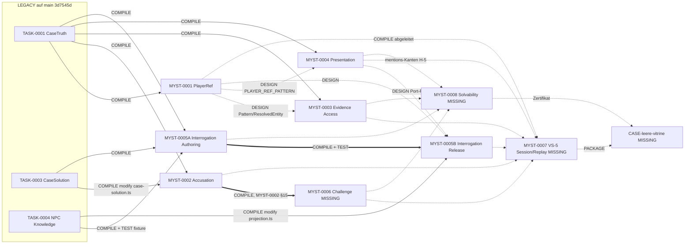

# MYSTERY CONTRACT CONSOLIDATION PLAN

Stand: 2026-10-04, ca. 07:30Z. Read-only erstellt: keine Änderung an Repository, Branches, PRs oder bestehenden Projektdateien.
Repository: `Forge-Dice/Forge`. `origin/main` = `3d7545d843883418348004e68717399a64da7a7d` (heute selbst geprüft).
Scope: nur Metadaten, IDs, Abhängigkeiten, Versionierung, Reihenfolge, Namen. Keine Domain-Änderung, kein Re-Design.

Autorität: Dieses Dokument ist ein Vorschlag. Es behauptet für keinen Contract eine Freigabe. Alles, was eine Entscheidung braucht, steht in §13.

Geprüfte Quellen (nur Frontmatter und die jeweils nötigen Abschnitte):
`forge-audits/MYST-0001…0005B*.contract*.md`, MYST-0002/0003/0004/0005-Pakete (Schätzungen), `OVERNIGHT-EXECUTION-PLAN.md` (ID-Tabelle), `MYSTERY-TASK-0006-CANDIDATES.md` §5, `FORGE-V0.1-ARCHITECTURE-FREEZE.md` (OE-2, Zeile „ID TASK-0006“), auf `main`: `src/forge/contract-document.ts`, `src/forge/primitives.ts`, `src/forge/start-gate.ts`, `forge/BASELINE-STATUS.md`, `tests/forge-red-team/differential.test.ts`, `forge/contracts/TASK-0004.md`; Branches `codex/mystery-task-0005`, `claude/forge-architecture-review-hjdq89`.

Alle Hashes unten wurden heute neu aus den Dateien berechnet und stimmen mit den bei Erstellung notierten Werten überein. Die Drafts sind also seit ihrer Erstellung unverändert.

---

## 1. Inventory

Kurzlegende: **F1** = `forgeContractFormat: 1` (`---json`, von `main` geparst). **F2** = Format-2-Entwurf (`specifiedAgainst`, `reads`, `mutants`, `limits`, End-Marker), auf `main` nicht parsebar. „Base“ = `baseCommit` (F1) bzw. `specifiedAgainst` (F2). contentHash = SHA-256 über Präfix `forge-contract-v1\n` (F1) bzw. vorläufig `forge-contract-v2\n` (F2) + Dateibytes.

### 1.1 Aktuelle Mystery-Contracts

| Artefakt | Latest artifact (Projektdateien) | Base | Format | Version | contentHash (16) | Deklarierte `dependencies` | Scope | LOC Prod (Schätzung / Limit) | Tests | Mutanten | Status |
|---|---|---|---|---|---|---|---|---|---|---|---|
| MYST-0001 PlayerRef V1 | `MYST-0001-PLAYERREF-V1.contract.DRAFT.md` | 3d7545d | F2 | 1 | `f4d3185898015901` (v2-Präfix, vorläufig) | TASK-0001 @3d7545d, `provenance: legacy` | create 4 (`player-ref.ts` + 3 Tests), modify 0 | – / **220** | ≈25 Matrixzeilen inkl. Golden Vectors | 8 (m1–m8, wörtlich) | **BLOCKED** (F2-Parser fehlt auf `main`) |
| MYST-0002 Accusation & Verdict | `MYST-0002.contract.FINAL-CANDIDATE.md` | 3d7545d | F1 | 1 | `e1eba9e1e248376f` | `[]` | create 5, modify 1 (`case-solution.ts`) | 170–230 / **220** | AV-01…AV-65 | 10 (m1–m10, wörtlich) | **DRAFT** |
| MYST-0002 (Vorgänger) | `MYST-0002-ACCUSATION-VERDICT-V1.contract.DRAFT.md` | 3d7545d | F1 | 1 | `3758b20c5eef9ee9` | `[]` | wie oben | – / 300 | – | 8 | **SUPERSEDED** (durch FINAL-CANDIDATE, nie registriert) |
| MYST-0003 Evidence Access | `MYST-0003-EVIDENCE-ACCESS-V1.contract.DRAFT.md` | 3d7545d | F1 | 1 | `8574f1e2a2b37a53` | `[]` | create 7, modify 0 | 185–210 (Prototyp ≈190) / **260** | A-01…A-77 | 9 (M1–M9, wörtlich) | **DRAFT** |
| MYST-0004 Evidence Presentation | `MYST-0004-EVIDENCE-PRESENTATION-V1.contract.DRAFT.md` | 3d7545d | F1 | 1 | `b3848250f336ac92` | `[]` | create 7, modify 0 | Prototyp 281 / **290** | A-01…A-76 | 9 (m1–m9, wörtlich) | **DRAFT** |
| MYST-0005A Interrogation Authoring | `MYST-0005A-INTERROGATION-AUTHORING-V1.contract.DRAFT.md` | 3d7545d | F1 | 1 | `dc7c48f5221c19bd` | `[]` | create 7, modify 0 | – / **260** | #1–#34 | 8 (A-M1–A-M8, **nur Prosa**) | **DRAFT** |
| MYST-0005B Interrogation Runtime/Release | `MYST-0005B-INTERROGATION-RELEASE-V1.contract.DRAFT.md` | 3d7545d | F1 | 1 | `621d94163b5035cf` | MYST-0005A, `acceptedCommit: null` (absichtliche Startsperre) | create 6, modify 1 (`npc-knowledge.projection.ts`, netto ≤ +50) | – / **280** | ≈45 (79 im Paket minus 34 aus 0005A; abgeleitet) | 11 (B-M1–B-M11, **nur Prosa**) | **BLOCKED** (bis MYST-0005A akzeptiert) |
| MYST-CHALLENGE-0001 | **MISSING** (nicht in Projektdateien, nicht im Repo) | ? | ? | ? | – | laut MYST-0002 §15: nur Exporte von MYST-0002 | ? | ? | ? | ? | nicht feststellbar |
| MYST-SOLVABILITY-0001 | **MISSING** | ? | ? | ? | – | ? | ? | ? | ? | ? | nicht feststellbar |
| VS-5 Session/Replay (Preflight, 123 Checks) | **MISSING** | ? | – | – | – | – | – | Roadmap-Schätzung Session 280–380 + Save/Replay 120–200 (OVERNIGHT §M7/M8) | – | – | nicht feststellbar |
| „Die leere Vitrine“ (Case Spec) | **MISSING** | – | – | – | – | – | – | – | – | – | nicht feststellbar |

Hinweise:
- Die vier MISSING-Artefakte wurden nicht rekonstruiert. Sie bekommen in §2 eine reservierte ID und in §8 einen Queue-Platz, damit sie beim Einreichen ohne neue Debatte einsortiert werden.
- Mutanten „nur Prosa“ heißt: Anker sind wörtlich, die Mutation ist beschrieben („R1 entfernt“), aber ohne wörtlichen `after`-Text. Das reicht nicht für eine mechanische Format-2-Transkodierung und nicht für einen unabhängigen Verifier (siehe §8, NEEDS SMALL REPAIR).
- Alle aktuellen MYST-Drafts stehen auf derselben Base `3d7545d` = heutiger `main`. Die in der Aufgabe vermutete Base-Drift betrifft heute nur die historischen Artefakte (TASK-0004 auf `5bfa5a4`, TASK-0005 auf einem Stand vor PR #1). Die Prozedur in §6 ist trotzdem nötig, sobald der erste MYST-Task gemergt wird.

### 1.2 Historische Artefakte

| Artefakt | Ort | Base | Format | Version | Status | Bemerkung |
|---|---|---|---|---|---|---|
| TASK-0001 / 0001a CaseTruth | `main` (Code), kein Forge-Contract im Repo | – | – | – | **IMPLEMENTED** | Legacy, nicht im ForgeLog registriert |
| TASK-0002 Semantic Validator | `main` | – | – | – | **IMPLEMENTED** | Legacy |
| TASK-0003 CaseSolution | `main` | – | – | – | **IMPLEMENTED** | Legacy |
| TASK-0004 NPC Knowledge | `main`, `forge/contracts/TASK-0004.md` (YAML, blob `334fe6fe…`) | `5bfa5a4` | YAML (weder F1 noch F2) | 1 | **IMPLEMENTED** | Metadaten sagen `status: approved` / `pending_chatgpt_final_check`; laut `BASELINE-STATUS.md` nicht Forge-konform. Nicht umschreiben. |
| TASK-0005 Dialogue Policy v2 | nur Branch `codex/mystery-task-0005` (`forge/contracts/TASK-0005.md`, blob `1e6f36e5…`, Head `fab792a`) | Merge-Base `e9cb8e2` | Markdown/YAML-Kopf | 2 | **HISTORICAL** | Nie implementiert. v1-Review liegt auf `main`, v2-Review nur auf `claude/forge-architecture-review-hjdq89`. Vorschlag SUPERSEDED durch MYST-0005A/B: Owner-Entscheidung OE-M5-1 (§13). |
| TASK-0006 | nirgends als Contract | – | – | – | **HISTORICAL** (nur Referenzen) | siehe §2.2 |

---

## 2. ID Registry

### 2.1 Was der Kernel erlaubt

`TaskIdSchema` auf `main`: `/^[A-Z][A-Z0-9]*(-[A-Z0-9]+)+$/`; Contract-Pfad ist erzwungen `forge/contracts/<taskId>.md` (`contractPathFor`). Gültig sind also `MYST-0005A`, `MYST-CHALLENGE-0001` und `TASK-0006` gleichermaßen. Der Kernel verhindert keine Kollision über Namensräume hinweg; das muss diese Registry leisten.

### 2.2 TASK-0006: alle gefundenen Verwendungen

| # | Ort | Bedeutung von „TASK-0006“ |
|---|---|---|
| 1 | `main`: `tests/forge-red-team/differential.test.ts:33-34` | synthetische Test-ID (Zyklus TASK-0005 ↔ TASK-0006 im Differential-Fuzzer) |
| 2 | `main`: `forge/reviews/TASK-0005.architecture-review.md:247,254`; Branch-Review `TASK-0005.v2.architecture-review.md` (V2-O1/O2) | Folgetask „Verbalization / ConversationState“ |
| 3 | `main`: `forge/BASELINE-STATUS.md:45` | „Not included: TASK-0006“ |
| 4 | `MYSTERY-TASK-0006-CANDIDATES.md` §5, Roadmap 0006–0010 | Accusation & Verdict (VS-1), dazu TASK-0007/0008 als Folgetasks |
| 5 | `FORGE-V0.1-ARCHITECTURE-FREEZE.md` OE-2, Konfliktzeile 16 | VS-1 sollte `TASK-0006` erhalten (offene Owner-Entscheidung) |
| 6 | `FORGE-CONTRACT-SYSTEM-V2.md`, `FORGE-DEEP-AUDIT.md`, `FORGE-INDEPENDENT-VERIFIER-DESIGN.md`, `FORGE-IDENTITY-GITHUB-PROTECTION.md` | Platzhalter-ID in Beispielen (Pfade, Run-Refs, Findings `F-TASK-0006-14-1`) |
| 7 | Branch `codex/mystery-task-0005`: `TASK-0005.md:476`, `coordination/CODEX.md:5` | „keine TASK-0006-Arbeit“ (Abgrenzung) |

Ergebnis: TASK-0006 hat mindestens vier unvereinbare Bedeutungen (Test-Fixture, Verbalization, Accusation, Doku-Beispiel). Jede künftige Registrierung unter `TASK-0006` würde mindestens eine davon falsch machen. Die Accusation-Arbeit ist inzwischen MYST-0002.

### 2.3 Endgültige Namensregeln (Vorschlag)

- **R-ID-1 Namensraum geschlossen.** `TASK-NNNN` wird für neue Arbeit nie wieder vergeben. TASK-0001…0005 bleiben als historische IDs gültig. **TASK-0006 bis TASK-0010 sind dauerhaft retired** (weil in Dokumenten mit Bedeutung belegt); kein Contract darf sie je tragen.
- **R-ID-2 Ein Zähler für Mystery.** Neue Mystery-Contracts heißen `MYST-NNNN`, vierstellig, fortlaufend in Vergabereihenfolge. Die Nummer sagt nichts über Ausführungsreihenfolge; die steht im DAG (§4).
- **R-ID-3 Splits.** Wird ein Task vor Registrierung geteilt, bekommen die Teile Suffixe `A`, `B`, … an derselben Nummer (Präzedenz MYST-0005A/B). Die unsuffixierte Nummer wird dann nie selbst registriert.
- **R-ID-4 Eine ID gehört genau einem Thema für immer.** Eine einmal vergebene ID wird nicht umgewidmet, auch wenn das Thema verworfen wird (dann: OBSOLETE in der Registry, Nummer bleibt verbraucht).
- **R-ID-5 Aliasse statt Umbenennungen.** Arbeitsnamen wie `MYST-CHALLENGE-0001` werden in der Registry als Alias der vergebenen ID geführt. Dateien, die den Alias schon tragen, werden nicht umbenannt.
- **R-ID-6 Historische Dateien werden nie umbenannt oder umgeschrieben.** Dazu gehören alle `forge-audits/*`, `forge/reviews/*`, `forge/contracts/TASK-0004.md` und der TASK-0005-Branch. Korrekturen stehen nur in neuen Dokumenten (wie diesem).
- **R-ID-7 Vergabe.** Eine Nummer gilt als vergeben, sobald sie in dieser Registry (bzw. ihrem Nachfolger) mit Thema steht. Nur der Owner vergibt. Ein Draft ohne vergebene Nummer heißt `MYST-XXXX-<slug>`.
- **R-ID-8 Fall-IDs.** Ein Fall heißt im Dateinamen `CASE-<slug>`; seine kanonische ID ist die `caseId` der CaseTruth (`case:<slug>`). Fälle bekommen keine Task-ID.
- **R-ID-9 Forge-Namensräume** (`FORGE-CORE-*`, `FORGE-VERIFIER-*`, `FORGE-OPS-*`, `PLAT-*`) sind nicht Teil dieser Registry.

### 2.4 Registry

| ID | Thema | Alias | Status | Quelle der Vergabe |
|---|---|---|---|---|
| TASK-0001, 0001a, 0002, 0003, 0004 | Legacy-Domain | – | IMPLEMENTED | historisch |
| TASK-0005 | Dialogue Policy v2 | – | HISTORICAL (Vorschlag: SUPERSEDED durch MYST-0005A/B) | historisch |
| TASK-0006…TASK-0010 | retired | – | HISTORICAL | dieser Plan |
| MYST-0001 | PlayerRef V1 | – | BLOCKED | OVERNIGHT-Plan |
| MYST-0002 | Accusation & Verdict (Core) | „VS-1“, ehem. „TASK-0006“-Kandidat | DRAFT | OVERNIGHT-Plan |
| MYST-0003 | Evidence Access | „VS-2“ | DRAFT | OVERNIGHT-Plan |
| MYST-0004 | Evidence Presentation & Release | – | DRAFT | Owner (überschreibt OVERNIGHT „Interrogation“) |
| MYST-0005A / 0005B | Interrogation Authoring / Runtime-Release | „VS-3/VS-4“-Interrogation | DRAFT / BLOCKED | Owner, Split per R-ID-3 |
| **MYST-0006** (Vorschlag) | Player Challenge (Folgetask aus MYST-0002 §15) | `MYST-CHALLENGE-0001` | Artefakt MISSING | Owner-Entscheidung OD-C1 |
| **MYST-0007** (Vorschlag) | VS-5 Session/Replay; bei Split 0007A Package, 0007B Session, 0007C Save/Replay+E2E | „VS-5 Session/Replay“ | Artefakt MISSING | OD-C1 |
| **MYST-0008** (Vorschlag) | Solvability V1 | `MYST-SOLVABILITY-0001` | Artefakt MISSING | OVERNIGHT reservierte 0008 bereits dafür; OD-C1 |
| CASE-leere-vitrine | Fall „Die leere Vitrine“ | – | Artefakt MISSING | R-ID-8 |

Damit ersetzt: OVERNIGHT-Plan „MYST-0004 Interrogation“, „MYST-0005 Case Package“, „MYST-0006 Session“, „MYST-0007 Save/Replay“ (nur die Nummern; die Planinhalte bleiben gültige Historie). OE-M4-9 und OE-M5-8 wären mit OD-C1 erledigt.

Alternative zu OD-C1 (falls der Owner die Arbeitsnamen behalten will): `MYST-CHALLENGE-0001` und `MYST-SOLVABILITY-0001` direkt als taskId registrieren (kernel-gültig). Nachteil: zweite und dritte Zählreihe, Registry muss drei Zähler führen. Empfehlung bleibt der einheitliche Zähler.

---

## 3. Dependency Types

| Typ | Definition | Gehört in `dependencies` des Contracts? | Blockiert |
|---|---|---|---|
| **DESIGN** | A übernimmt eine Festlegung aus B wörtlich oder strukturell (Pattern, Port-Form, Typform), importiert aber nichts. | **Nein.** Steht als „Pin“ im Contract-Text: B-Artefakt + contentHash. | Architecture Review von A, bis der zitierte Abschnitt von B eingefroren ist (§11). Nicht die Implementierung. |
| **COMPILE** | Produktionscode von A importiert Code, den B erst erzeugt (oder ändert eine Datei, die B erzeugt). | **Ja**, mit `acceptedCommit` von B. | Registrierung mit Startfreigabe: A braucht `acceptedCommit` von B im Base. |
| **RUNTIME** | A braucht zur Laufzeit Werte, die B erzeugt, bekommt sie aber über einen strukturellen Port; Tests nutzen Test-Doubles. | **Nein.** | Nur den späteren Integrator (Session/Package), nicht A. |
| **PACKAGE** | Ein Fall/Paket muss ein Dokument im Format von B enthalten (z. B. AccessMap). | **Nein** (Fälle sind keine Tasks). | Validierung des Falls, nicht Contracts. |
| **TEST** | Tests von A importieren Fixtures/Testdateien, die B erzeugt. | **Ja**, wie COMPILE. | wie COMPILE. |
| *LEGACY-BASE* | COMPILE/TEST auf TASK-0001…0004. | F1: **nein** (über `baseCommit` gebunden; Eintrag würde `DEPENDENCY_UNRESOLVED`/`MISMATCH` erzeugen). F2: ja, mit `provenance: legacy` und dem Commit, der sie enthält. | nichts (auf `main` enthalten). |

**Anti-Serialisierungsregel:** Nur COMPILE und TEST erzeugen eine Kante, die eine Registrierung oder einen Run wartet. DESIGN wartet nur auf ein eingefrorenes Zitat. RUNTIME und PACKAGE warten nie auf den Contract selbst. Ein Draft, der eine RUNTIME- oder DESIGN-Beziehung als `dependencies`-Eintrag führt, ist falsch normalisiert.

Konsistenzcheck der aktuellen Drafts gegen diese Regel: alle konform. MYST-0001 führt TASK-0001 als legacy-Eintrag, weil F2; MYST-0002…0005A führen `[]`, weil F1. Das ist kein Widerspruch, sondern dieselbe Kante in zwei Formaten (Mapping in §7).

---

## 4. DAG

Nur deklarierte Kanten aus den Contract-Texten. Gestrichelt (`-.->`) = aus Paketen/Plänen abgeleitet, weil der Contract fehlt.

Kantenliste (normativ für diesen Plan):

| Von → Nach | Typ | Beleg |
|---|---|---|
| TASK-0001 → MYST-0001…0005A | COMPILE (LEGACY-BASE) | Imports in jedem Draft (§1.2/§2 bzw. `reads`) |
| TASK-0003 → MYST-0002 | COMPILE (modify) | MYST-0002 scope.modify `case-solution.ts` |
| TASK-0003 → MYST-0005A | COMPILE | 0005A §2 Imports `ConclusionClaimSchema` |
| TASK-0004 → MYST-0005A | COMPILE + TEST | 0005A §2 (`npc-knowledge.ts`), §3 (`tests/npc-knowledge.fixture.ts`) |
| TASK-0004 → MYST-0005B | COMPILE (modify) | 0005B scope.modify `npc-knowledge.projection.ts` |
| **MYST-0005A → MYST-0005B** | **COMPILE + TEST** | 0005B `dependencies`, §5 Imports, §3 Fixture |
| MYST-0001 → MYST-0003 | DESIGN | 0003 §1: `KnownEntityRef` strukturell = `ResolvedEntity`, kein Import |
| MYST-0001 → MYST-0004 | DESIGN (+ RUNTIME für den Aufrufer) | 0004 §1.3: `PLAYER_REF_PATTERN` wörtlich, Port |
| MYST-0001, MYST-0004 → MYST-0005B | DESIGN | 0005B §1.2/§5: Pattern und Port „strukturell identisch MYST-0004“ |
| **MYST-0002 → MYST-0006** | **COMPILE** | MYST-0002 §15: Challenge-Wrapper nur auf Exporten von MYST-0002 |
| alles → MYST-0007, MYST-0008, Vitrine | abgeleitet | Contracts fehlen |

Keine Kanten (bewusst, aus den Drafts): MYST-0002 ↛ TASK-0004 (FREEZE §15.2 nannte sie fälschlich); MYST-0003 ↛ MYST-0004 und umgekehrt; MYST-0003/0004/0005B ↛ MYST-0001 als COMPILE.

**Folge: Die echte kritische Kette ist kurz.** Sofort parallel implementierbar (eine Welle): MYST-0002, MYST-0003, MYST-0004, MYST-0005A, und MYST-0001, sobald F2 existiert. Ihre Scopes sind paarweise disjunkt (geprüft: keine Datei in zwei `scope`-Listen). Danach: MYST-0005B und MYST-0006 (je eine Kante). Danach erst der Integrator MYST-0007, dann MYST-0008.

**Read-Overlap (Drift-Quelle, keine Abhängigkeit):** MYST-0002 ändert `src/domain/case-solution.ts`, das MYST-0005A und MYST-0005B importieren und MYST-0004 in seiner Faktentabelle zitiert. MYST-0005B ändert `npc-knowledge.projection.ts`. Wer nach dem Merge von MYST-0002 registriert wird, durchläuft §6 mit Read-Treffer (erwartet: additive Änderung, Klasse B).

---

## 5. Registration Order

Kernel-Fakt (`src/forge/start-gate.ts`): Ein Run startet bei `contractCommit` (dem Commit, der den Contract eingetragen hat), nicht bei `baseCommit`. `baseCommit` muss nur Vorfahre von `contractCommit` sein, und jede `acceptedCommit` einer Dependency muss Vorfahre von `baseCommit` sein. Die Registrierungs-Commits selbst ändern nur `forge/contracts/*`, das in keinem `reads` steht, erzeugen also keine Drift.

| Gruppe | Contracts | Bedingung |
|---|---|---|
| **R1 unabhängig registrierbar** | MYST-0002, MYST-0003, MYST-0004, MYST-0005A | F1, `dependencies: []`, Base = `main`. Reihenfolge untereinander beliebig. MYST-0004 erst nach Pin von MYST-0001 §D3 (DESIGN, §11). |
| **R2 wartet auf Forge** | MYST-0001 | F2-Parser auf `main` (oder Rück-Transkodierung nach F1, §7). Liegt nicht auf dem kritischen Pfad der anderen Contracts. |
| **R3 wartet auf `acceptedCommit`** | MYST-0005B (MYST-0005A), MYST-0006 (MYST-0002) | Erst registrieren, wenn der Upstream akzeptiert ist. Dann trägt der Contract den echten `acceptedCommit`, und `baseCommit` enthält ihn. |
| **R4 wartet auf mehrere** | MYST-0007, danach MYST-0008 | erst Draft schreiben, wenn die COMPILE-Upstreams akzeptiert sind (sonst reiner Spekulations-Draft) |

**Welche brauchen nach Upstream-Implementierung eine neue Revision?**
- **MYST-0005B:** sicher eine Überarbeitung (`acceptedCommit` eintragen, Base anheben, §1.2-Fakten gegen gemergten 0005A-Code abgleichen). Weil 0005B **vor** diesem Schritt nicht registriert wird, bleibt es `contractVersion: 1` (siehe §11, R-V-1). Eine echte v2 entsteht nur, wenn man 0005B mit `null` registriert. **Empfehlung: nicht tun.**
- **MYST-0005A, MYST-0004, MYST-0003:** nur dann, wenn MYST-0002 vor ihrer Registrierung gemergt wird und die Drift-Prüfung (§6) mehr als Klasse A ergibt. Erwartet: Klasse A oder B, keine Versionserhöhung.
- **MYST-0004 und MYST-0005B:** normative Überarbeitung, falls MYST-0001 sein Referenzformat (D3, `pr1_` + 16 Zeichen) vor dem eigenen Freeze ändert.
- **MYST-0006:** wird erst nach MYST-0002-Akzeptanz geschrieben/abgeglichen, also keine Revision durch Upstream nötig.

---

## 6. Base Drift Procedure

Mechanisch, ohne Git-Rebase. Eingabe: Contract C (Draft oder registriert), seine Base B, aktueller `main` N. Ergebnis: Klasse A/B/C/D und eine dokumentierte Zeile im Drift-Protokoll (§9 Naming: `<ID>.v<N>.reconcile-<shortN>.md` oder Abschnitt im Review).

| Schritt | Aktion | Mechanik |
|---|---|---|
| D0 Reread main | `git fetch origin main`; N = `origin/main`. Wenn N = B: fertig, Klasse A. | |
| D1 Check reads | Reads = F2-Feld `reads`, in F1 die Dateien aus der Faktentabelle (§1.2) und den Import-Listen; plus `scope.modify`. `git diff --name-status B N -- <reads ∪ scope.modify>` | leer → weiter mit D2, sonst merken |
| D2 Check scope | Jede `scope.create`-Datei existiert in N nicht (`git cat-file -e N:<path>` schlägt fehl). Jede `scope.modify`-Datei existiert. Kein anderer registrierter oder laufender Contract hat eine überlappende Scope-Datei. | Verletzung → Klasse D |
| D3 Check API | Für jede Zeile der Faktentabelle: Symbol, Signatur, Schema-Form in N noch wahr? Praktisch: `git diff B N -- <datei>` auf die zitierten Exporte lesen, plus `npm run typecheck` mit den Typecheck-Probes des Contracts, falls vorhanden. | nur additiv/unverändert → B; Bruch → C |
| D4 Regenerate mutants | Für Anker in `scope.modify`-Dateien: `grep -c` muss in N genau 1 ergeben. Anker in `scope.create`-Dateien sind driftfrei. Golden Vectors, die aus Legacy-Fixtures berechnet werden (z. B. `truthHash f445f3b4…` aus `tests/npc-knowledge.fixture.ts`), in N neu berechnen. | Abweichung → C |
| D5 Baseline | `npm run typecheck`, `npm test` auf N; Zählerstand notieren (heute 1087/1087). | rot → Stopp, kein Contract-Problem |
| D6 Update specifiedAgainst/baseCommit | siehe Klassen unten | |
| D7 Version | nur bei normativer Änderung **und** nur, wenn C schon registriert ist (R-V-1/R-V-2, §11) | |

Klassen:

| Klasse | Befund | Aktion am Contract | Version |
|---|---|---|---|
| **A** | Reads und Scope unberührt | **Nichts ändern.** Alte Base bleibt gültig (Kernel verlangt nur Vorfahr-Relation, Run startet ohnehin bei `contractCommit`). Kein neuer Hash, kein neues Review. | unverändert |
| **B** | Reads berührt, alle zitierten Fakten weiter wahr (additive Exporte, neue Dateien daneben) | Unregistriert: Base auf N heben, Faktentabelle um die Commit-Angabe ergänzen. Registriert: nichts ändern, Befund im Drift-Protokoll; der Implementierer arbeitet ohnehin auf `contractCommit` ⊇ N. | unregistriert: bleibt; registriert: bleibt |
| **C** | Ein zitierter Fakt, ein Mutationsanker oder ein Golden Vector ist in N falsch | Normative Reparatur: Faktentabelle, ggf. API-Abschnitt, Anker, Vektoren; Base = N. Review neu (gebunden an neuen Hash). | unregistriert: bleibt 1; registriert: **+1** |
| **D** | Scope kollidiert (Datei existiert schon, fremder Contract besitzt sie) | Owner-Entscheidung, kein mechanischer Weg | – |

„Update specifiedAgainst“ heißt hier also: nur bei B (unregistriert) und C. Ein Bump nur wegen Drift ohne inhaltliche Änderung ist verboten, weil er Reviews entwertet und künstliche Serialisierung erzeugt.

---

## 7. Format Migration

Abhängig vom parallelen Bootstrap-Plan (`FORGE-V0.1-BOOTSTRAP-CONTRACT-PLAN.md`), der zum Zeitpunkt dieses Plans **nicht** in den Projektdateien liegt. Wo er etwas anderes festlegt (Zeitpunkt von F2, Hash-Präfix, Feldnamen), gilt er. Die folgenden Regeln sind so gebaut, dass sie unabhängig vom F2-Zeitpunkt funktionieren.

**Annahme (zu bestätigen im Bootstrap-Plan):** Ein F2-fähiger Kernel liest F1-Contracts weiter. Ohne diese Annahme müssten registrierte F1-Contracts migriert werden; das wäre eine eigene Owner-Entscheidung.

| Fall | Regel |
|---|---|
| **M-1** F1-Contract schon registriert, dann erscheint F2 | Bleibt F1 für immer. Keine Transkodierung, keine neue Version. |
| **M-2** F1-Draft unregistriert, F2 erscheint vor Registrierung | Bei Registrierung **mechanisch transkodieren** (Tabelle unten). Body bleibt byte-gleich bis auf den Abschnitt „Format und Herkunft“. `contractVersion` bleibt 1 (nie registriert). Neuer contentHash. Ein schon vorhandenes Architecture Review wird nicht wiederholt, sondern per **Transcode-Nachweis** übertragen: Skript zeigt, dass Body außerhalb Frontmatter + Format-Absatz identisch ist und jedes F2-Feld aus einer zitierten Body-Stelle stammt. Der Reviewer bestätigt nur diesen Diff. |
| **M-3** F1-Draft, Review noch nicht begonnen, F2-Zeitpunkt bekannt und vor geplanter Registrierung | Erst transkodieren, dann reviewen (spart den Transcode-Nachweis). |
| **M-4** F2-Draft (MYST-0001), F2 kommt später | Warten. MYST-0001 blockiert keinen anderen Contract (nur DESIGN/RUNTIME-Kanten). Nur wenn der Owner MYST-0001 vorher implementieren will: einmalige Rück-Transkodierung nach F1 (Felder `reads`, `mutants`, `limits` in Prosa, `specifiedAgainst`→`baseCommit`, legacy-Dependency → `[]`), unregistriert also ohne Versionssprung. |
| **M-5** Neue Drafts ab heute | Format des Kernels auf `main` zum Zeitpunkt des Schreibens. Nie ein Format vortäuschen, das `main` nicht parst. |

Feldmapping F1 → F2 (nach MYST-0001-Draft; endgültige Namen aus dem Bootstrap-Plan):

| F2-Feld | Quelle im F1-Draft | mechanisch? |
|---|---|---|
| `forgeContractFormat: 2` | – | ja |
| `taskId`, `contractVersion`, `scope`, `requiredChecks` | Frontmatter | ja, 1:1 |
| `title` | H1 ohne „(DRAFT)“ | ja |
| `specifiedAgainst` | `baseCommit` | ja |
| `supersedes` | `null` (für alle aktuellen Drafts) | ja |
| `dependencies` | `[]` + Legacy-Prosa → `{taskId, acceptedCommit: <Commit, der sie enthält>, provenance: "legacy"}` je LEGACY-BASE-Kante aus §4 | ja, aus §4-Kantenliste |
| `reads` | Faktentabelle §1.2 + Import-Liste | ja, Dateipfade sortiert |
| `mutants` | Mutantentabelle | **nur wenn wörtlich**: MYST-0002/0003/0004 ja; **MYST-0005A/0005B nein** (Prosa) → Reparatur vorher (§8) |
| `limits.maxProductionLines` / `maxChangedFiles` | AC „Größe“ bzw. §2-Limittabelle | ja |
| `mutationSmoke: required` | entfällt, wenn F2 `mutants` Pflicht macht | laut Bootstrap-Plan |
| End-Marker `<!-- END OF CONTRACT <ID> v<N> -->` | anhängen | ja |

Damit muss keine Spec neu geschrieben werden. Die einzige inhaltliche Vorarbeit ist das Wörtlich-Machen der 19 Prosa-Mutanten in 0005A/B, die ohnehin für einen unabhängigen Verifier nötig ist.

---

## 8. Repair Queue

Priorität von oben nach unten. „Small repair“ heißt: Metadaten oder Verifikationsangaben, keine Domain-Änderung, bei unregistrierten Drafts ohne Versionssprung.

| Prio | Queue | Artefakt | Was fehlt / nächster Schritt |
|---|---|---|---|
| 1 | **READY FOR ARCH REVIEW** | MYST-0002 v1 FINAL-CANDIDATE (`e1eba9e1…`) | Owner-Bestätigungen N-1…N-4 (gehören ins Review). Bekannte Abweichung außerhalb des Contracts: Solvability-Research nutzt Argumentreihenfolge `(acc, truth, solution)`, Contract `(truth, solution, accusation)`; Contract gilt. |
| 2 | **READY FOR ARCH REVIEW** | MYST-0003 v1 (`8574f1e2…`) | Owner-Antworten OE-M3-1…6 ins Review. |
| 3 | **NEEDS SMALL REPAIR** | MYST-0005A v1 (`dc7c48f5…`) | Mutanten A-M1…A-M8 als wörtliche `before → after`-Paare ausschreiben (Anker existieren schon). Danach READY. OE-M5-1…8 ins Review. |
| 4 | **NEEDS SMALL REPAIR** | MYST-0004 v1 (`b3848250…`) | (a) DESIGN-Pin auf MYST-0001 ergänzen: Artefakt + contentHash `f4d31858…`, Abschnitt D3, statt nur „wörtlich MYST-0001 D3“. (b) „Nummernhinweis“-Absatz auf die Registry (§2.4) verweisen lassen. Beides nicht normativ für den Code. OE-M4-1…9 ins Review. |
| 5 | **WAIT FOR FORGE** | MYST-0001 v1 (F2) | F2-Parser auf `main` (Bootstrap-Plan). Laut OVERNIGHT-Plan erster echter Forge-Run (F6); diese Rolle ist von der Mystery-Kette entkoppelt. |
| 6 | **WAIT FOR DEPENDENCY** | MYST-0005B v1 (`621d9416…`) | `acceptedCommit` von MYST-0005A. Vorher schon möglich (empfohlen, gleiche Gründe wie Prio 3): Mutanten B-M1…B-M11 wörtlich machen. |
| 7 | **WAIT FOR DEPENDENCY** | MYST-0006 Challenge (`MYST-CHALLENGE-0001`, MISSING) | Artefakt in Projektdateien ablegen; dann gegen MYST-0002 (eingefroren) normalisieren. Registrierung nach MYST-0002-Akzeptanz. |
| 8 | **WAIT FOR DEPENDENCY** | MYST-0007 VS-5 Session/Replay (Preflight MISSING) | Preflight ablegen; Contract erst nach MYST-0002/0003/0004/0005B (+0001, 0006) akzeptiert. |
| 9 | **WAIT FOR DEPENDENCY** | MYST-0008 Solvability (`MYST-SOLVABILITY-0001`, MISSING) | nach MYST-0007; Argumentreihenfolge an MYST-0002 angleichen. |
| 10 | **WAIT FOR DEPENDENCY** | CASE-leere-vitrine (MISSING) | Case Spec ablegen; Ownership-Prüfung §10 ausführen. |
| – | **OBSOLETE** | MYST-0002 Draft v1 (`3758b20c…`) | ersetzt durch FINAL-CANDIDATE. Datei bleibt liegen. |
| – | **OBSOLETE** | TASK-0005 v2 Contract (Branch) | nach OE-M5-1: SUPERSEDED durch MYST-0005A/B. Branch nicht anfassen. |
| – | **OBSOLETE** | ID-Tabellen in `OVERNIGHT-EXECUTION-PLAN.md` (MYST-0004…0007) und `MYSTERY-TASK-0006-CANDIDATES.md` (TASK-0006…0010) | durch §2.4 ersetzt. Dateien bleiben unverändert. |

Hinweis: „Registrierbar“ heißt hier nur „Contract fertig“. Ob der Forge-Prozess eine Registrierung schon technisch trägt (Verifier, Rulesets, OE-6…OE-11), entscheidet der Forge-Pfad, nicht diese Queue.

---

## 9. Naming Convention

Nur Konvention für neue Dateien. Bestehende Dateien bleiben wie sie sind (R-ID-6). `<ID>` = taskId, `<N>` = contractVersion, `<reviewer>` = `claude` | `chatgpt` | `grok` | `codex` | `owner`.

| Artefakt | Projektdateien (Draft-Phase) | Repository (nach Registrierung) |
|---|---|---|
| Contract | `forge-audits/<ID>.v<N>.contract.DRAFT.md` (Freeze-Kandidat: `.contract.FROZEN.md`) | `forge/contracts/<ID>.md` (vom Kernel erzwungen; Versionen = Git-Historie dieses Pfads, keine `.v2.md`-Sidecars für neue Contracts) |
| Design-/Paketbericht | `forge-audits/<ID>.v<N>.package.md` | – |
| Architecture Review | `forge-audits/<ID>.v<N>.architecture-review.<reviewer>.md` | `forge/reviews/<ID>.v<N>.architecture-review.<reviewer>.md`; Approval-Record wie bestehend `forge/approvals/<ID>.v<N>.architecture_review.json` |
| Code Review | – | `forge/reviews/<ID>.v<N>.code-review.<reviewer>.md` |
| Verification Evidence | – | `forge/reviews/<ID>.v<N>.verification.md` + `forge/reviews/<ID>.v<N>.mutations.json` (Muster FORGE-CORE-0001B.v2) |
| Drift-/Reconcile-Protokoll | `forge-audits/<ID>.v<N>.reconcile-<short-main-sha>.md` | als Abschnitt im Review |
| Case Spec | `forge-audits/cases/CASE-<slug>.case.md` (+ Daten `CASE-<slug>.<dokument>.json`, z. B. `.truth.json`, `.access.json`) | Ort im Repo erst mit MYST-0007 (Package) festlegen |
| Solvability Certificate | `forge-audits/cases/CASE-<slug>.solvability-cert.<checker-ID>.v<N>.json` | wie Case Spec |

Jede Datei nennt in ihrer ersten Zeile den contentHash des Contracts, auf den sie sich bezieht. Reviews und Zertifikate ohne Hash-Bindung zählen nicht.

---

## 10. Vitrine Ownership Map

Die Case Spec „Die leere Vitrine“ liegt nicht vor. Die folgende Karte ordnet deshalb jede **Datenart**, die ein Fall nach den aktuellen Drafts enthalten kann, ihrem autoritativen Validator zu. Sobald die Datei abgelegt ist, wird jeder Top-Level-Schlüssel genau einer Zeile zugeordnet; jeder Schlüssel ohne Zeile ist unowned.

| Bestandteil | Autoritativer Validator | Status des Validators |
|---|---|---|
| `caseId`, `truthHash`-Bindung | TASK-0001 (`hashCaseTruth`); jeder gebundene Parser prüft sie | IMPLEMENTED |
| Personen, Orte, Items, Events, Beziehungen, Motive, Zeit (Ticks) | TASK-0001 Schema + TASK-0002 Semantik | IMPLEMENTED |
| Propositionen, Evidence (`links`, `direction`, `source`), Secrets, Red Herrings | TASK-0001/0002 | IMPLEMENTED |
| Auflösung, Conclusions, `requiredConclusions` | TASK-0003 | IMPLEMENTED |
| Was als „Fall gelöst (Core)“ zählt | MYST-0002 | DRAFT |
| Spieler-Challenge (`allowedClaims`, was der Spieler einreichen muss) | MYST-0006 Challenge | MISSING |
| NPC-Wissen, Überzeugungen, Projektion | TASK-0004 | IMPLEMENTED |
| Fragenkatalog, NPC-Befragungsprofile, Release-Regeln R1–R4 | MYST-0005A | DRAFT |
| Antworten zur Laufzeit (Stance, Freigabe) | MYST-0005B | BLOCKED |
| Wo/wie Evidence gefunden wird (AccessMap, Pfade) | MYST-0003 | DRAFT |
| Spielertext, `mentions`, `reports` je Evidence | MYST-0004 | DRAFT |
| PlayerRef-Salt und Referenzindex | MYST-0001 | BLOCKED |
| Lösbarkeitsnachweis | MYST-0008 | MISSING |
| Spielverlauf, Save/Replay | MYST-0007 | MISSING |

**Unowned (heute kein Contract zuständig):**

| # | Daten | Beleg | Vorgeschlagener Owner |
|---|---|---|---|
| U-1 | Start-Wissensmenge `known` (womit der Spieler beginnt) | MYST-0003 nimmt `known` als Eingabe; niemand autorisiert sie | MYST-0007 (Package/Session) |
| U-2 | Spielerseitige Namen/Labels von Personen, Orten, Items | MYST-0004 §13 schließt es aus („eigener späterer Task“), MYST-0003 ebenso | neue ID bei Bedarf (Entity Presentation) |
| U-3 | Fall-Briefing, Titel, Einleitungstext | in keinem Draft | wie U-2 |
| U-4 | Freischalt-Kanten (Fund oder Antwort macht neues Ziel bekannt: `mentions`/`reveal` → `known`) | Pakete MYST-0003 H-7, MYST-0004 H-5, MYST-0005 („VS-5: known += mentions“); in keinem Contract normativ | Laufzeit: MYST-0007; Analyse: MYST-0008 |
| U-5 | Paket-Manifest, das alle Hashes bindet (truth, solution, access, presentation, catalogue, profiles, refSalt) | kein Draft | MYST-0007 (bzw. 0007A bei Split) |
| U-6 | Evidence, die nur über ein Event erreichbar wäre | MYST-0003 kennt nur `search_location`/`examine_item`/`examine_person` | Fallautor vermeidet es in V1, sonst neue Revision von MYST-0003 (Owner) |
| U-7 | Lügende NPCs | MYST-0005 V1 ohne Lügen | außerhalb V1; falls die Vitrine es braucht: Owner-Entscheidung |

---

## 11. Freeze Rules

**F-1 Wann hören wir auf, parallel zu entwickeln?** Ab diesem Plan (Freeze-Punkt D0) ändern sich die normativen Inhalte von MYST-0001…0005B nur noch durch (a) die in §8 genannten Small Repairs, (b) Review-Befunde, (c) Drift-Klasse C. Neue Drafts nur für IDs, deren COMPILE-Upstreams eingefroren sind (heute: MYST-0006 auf MYST-0002). Höchstens zwei Drafts gleichzeitig „in Änderung“ (entspricht der Thread-Grenze des Projekts).

**F-2 Wann ist ein Contract eingefroren für Architecture Review?** Wenn alle Punkte gelten:
1. Frontmatter parst mit dem Parser auf aktuellem `main` (oder F2-Draft liegt explizit in WAIT FOR FORGE).
2. Drift-Prüfung §6 gegen aktuellen `main` ist Klasse A oder B.
3. Jede DESIGN-Kante ist gepinnt (Artefakt + contentHash), und das gepinnte Artefakt ist selbst eingefroren.
4. Mutanten sind wörtlich (`before`/`after`), Anker kommen genau einmal vor.
5. Golden Vectors sind mit zwei unabhängigen Werkzeugen reproduziert.
6. Kein „offen“, „TODO“ oder „Owner entscheidet“ in normativen Abschnitten; offene Punkte stehen als nummerierte Owner-Fragen außerhalb und sind beantwortet.
7. contentHash ist in der Registry eingetragen. Ab dann ist die Datei byte-eingefroren; jede Änderung, auch redaktionell, erzeugt einen neuen Hash und entwertet das Review.

**F-3 Versionierung.**
- **R-V-1** `contractVersion` zählt **registrierte** Revisionen. Vor der Registrierung bleibt ein Draft auf `1`, auch nach Reparaturen; die Registry hält die Hash-Kette (Präzedenz MYST-0002: `3758b20c…` → `e1eba9e1…`, beide v1).
- **R-V-2 Zwingend v2 (bzw. +1)**, wenn ein **registrierter** Contract sich in irgendeinem Byte ändert, egal ob normativ oder redaktionell. Der Kernel bindet an den contentHash, eine stille Änderung gibt es nicht.
- **R-V-3** Normative Änderungen nach Beginn eines Reviews, aber vor Registrierung: Version bleibt 1, Review beginnt neu (gebunden an den neuen Hash).
- **R-V-4** Drift ohne inhaltliche Änderung (Klasse A/B) erzeugt nie eine neue Version (§6).
- **R-V-5** Ein Contract mit `acceptedCommit: null` wird nicht registriert (vermeidet eine erzwungene v2, betrifft MYST-0005B).
- **R-V-6** Transkodierung F1→F2 eines unregistrierten Drafts ist keine neue Version (§7 M-2).

---

## 12. Exact Next Contracts

In dieser Reihenfolge, je ein Schritt pro freiem Thread (max. zwei parallel):

1. **MYST-0002 v1** `MYST-0002.contract.FINAL-CANDIDATE.md`, contentHash `e1eba9e1e248376f18774ee8899208c4a7a066e0cf5d5cc23973db4b3cf91e1c`, Base `3d7545d`, F1 → Architecture Review (nicht-Anthropic-Reviewer laut früheren GO-Bedingungen).
2. **MYST-0003 v1** contentHash `8574f1e2…` → Architecture Review (parallel zu 1 möglich).
3. **MYST-0005A v1** → Small Repair (wörtliche Mutanten), neuer Hash in die Registry, dann Architecture Review.
4. **MYST-0004 v1** → Small Repair (DESIGN-Pin auf MYST-0001, Nummernhinweis), dann Architecture Review.
5. Implementierungswelle 1, sobald der Forge-Pfad Registrierungen trägt: MYST-0002, MYST-0003, MYST-0004, MYST-0005A unabhängig voneinander. Nach jedem Merge für die übrigen §6 ausführen (erwartet Klasse A/B).
6. Danach: MYST-0005B Reconcile auf akzeptiertes MYST-0005A; MYST-0006 Challenge normalisieren und auf akzeptiertes MYST-0002 setzen.
7. MYST-0001 sobald F2 auf `main` liegt (oder per Owner-Entscheidung früher als F1).
8. Erst dann MYST-0007 (VS-5) und anschließend MYST-0008; die Vitrine wird gegen beide validiert.

Nicht jetzt: kein neuer Draft für MYST-0007/0008, keine Weiterentwicklung der Domain in den bestehenden Drafts.

---

## 13. Owner Decisions

| ID | Frage | Empfehlung |
|---|---|---|
| OD-C1 | Einheitlicher Zähler: MYST-0006 = Challenge (Alias MYST-CHALLENGE-0001), MYST-0007 = VS-5 Session/Replay, MYST-0008 = Solvability (Alias MYST-SOLVABILITY-0001)? Erledigt zugleich OE-M4-9 und OE-M5-8. | ja |
| OD-C2 | TASK-0006…TASK-0010 dauerhaft retired, `TASK-*` für neue Arbeit geschlossen? Erledigt OE-2 aus dem Architecture Freeze. | ja |
| OD-C3 | TASK-0005 v2 als SUPERSEDED durch MYST-0005A/B führen (= OE-M5-1)? | ja |
| OD-C4 | Nur COMPILE/TEST-Kanten gehören in `dependencies`; DESIGN als Hash-Pin im Text. | ja |
| OD-C5 | Drift-Klasse A/B ändert registrierte Contracts nicht (kein Bump, kein neues Review). | ja |
| OD-C6 | Format: registrierte F1-Contracts bleiben F1; unregistrierte werden bei Registrierung transkodiert; MYST-0001 wartet auf F2 statt Rück-Transkodierung. Vorbehaltlich des Bootstrap-Plans. | ja |
| OD-C7 | Freeze-Punkt D0 jetzt, WIP-Limit zwei Drafts. | ja |
| OD-C8 | Small Repairs aus §8 (0005A/0005B wörtliche Mutanten, 0004 Pin) ohne Versionssprung freigeben. | ja |
| OD-C9 | Naming Convention §9 für neue Dateien übernehmen. | ja |
| OD-C10 | Fehlende Artefakte (MYST-CHALLENGE-0001, MYST-SOLVABILITY-0001, VS-5-Preflight, „Die leere Vitrine“) in `forge-audits/` ablegen, damit Inventar und Ownership-Map vollständig werden. | ja |
| OD-C11 | Unowned U-1…U-5 (§10) MYST-0007 zuordnen; U-2/U-3 als künftige eigene ID vormerken. | ja |

Weiterhin offen aus früheren Paketen (unverändert, hier nur gelistet): MYST-0002 N-1…N-4; MYST-0003 OE-M3-1…6; MYST-0004 OE-M4-1…8; MYST-0005 OE-M5-2…7; Forge OE-1…OE-11.

STOP.
