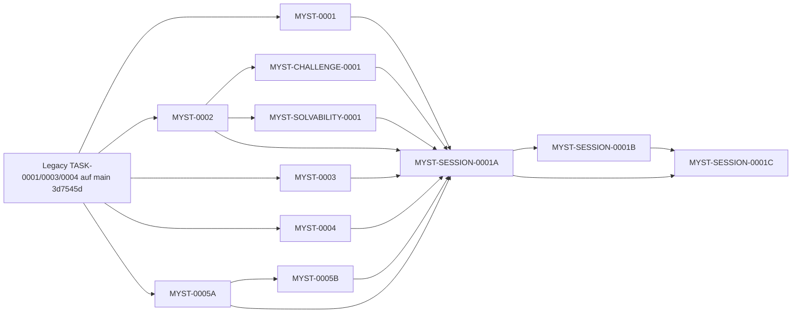

# FINAL DEPENDENCY DAG — Mystery Contract Set

Erzeugt nach allen Repairs. Knoten = Contract-Identität dieses Pakets (MYSTERY-FINAL-CONTRACT-MANIFEST.json). Kanten nur, wenn eine echte Implementierungs-, Laufzeit/Paket- oder Designbeziehung besteht; keine Kante nur deshalb, weil Komponenten im selben Spiel vorkommen.

## Knoten

| Task | Identität | Entscheidung |
|---|---|---|
| MYST-0001 | `f4d318589801… (v1)` | UNCHANGED |
| MYST-0002 | `65b12f758d6e… (v2)` | NEW REVISION REQUIRED |
| MYST-0003 | `8574f1e2a2b3… (v1)` | UNCHANGED |
| MYST-0004 | `18e383d06a8e… (v2)` | NEW REVISION REQUIRED |
| MYST-0005A | `dc7c48f5221c… (v1)` | UNCHANGED |
| MYST-0005B | `ad5702488089… (v2)` | NEW REVISION REQUIRED |
| MYST-CHALLENGE-0001 | `b29fab7b7039… (v2)` | NEW REVISION REQUIRED |
| MYST-SOLVABILITY-0001 | `5eb4b289d17e… (v1)` | UNCHANGED |
| MYST-SESSION-0001A | `f48559e0ba61… (v2)` | NEW REVISION REQUIRED |
| MYST-SESSION-0001B | `deeeef058908… (v2)` | NEW REVISION REQUIRED |
| MYST-SESSION-0001C | `8df316a16638… (v2)` | NEW REVISION REQUIRED |

## Kanten

| Von | Nach | Klasse | Grundlage |
|---|---|---|---|
| MYST-0001 | TASK-0001 (legacy, main) | HARD IMPLEMENTATION DEPENDENCY | frontmatter (acceptedCommit = main); parseCaseTruth/hashCaseTruth |
| MYST-0002 | TASK-0001/TASK-0003 (legacy, baseCommit) | HARD IMPLEMENTATION DEPENDENCY | case-truth / case-solution modules on baseCommit; no frontmatter entry (legacy, not Forge-managed) |
| MYST-0003 | TASK-0001 (legacy, baseCommit) | HARD IMPLEMENTATION DEPENDENCY | case-truth types on baseCommit |
| MYST-0004 | TASK-0001 (legacy, baseCommit) | HARD IMPLEMENTATION DEPENDENCY | case-truth types on baseCommit |
| MYST-0005A | TASK-0001/0003/0004 (legacy, baseCommit) | HARD IMPLEMENTATION DEPENDENCY | AwarenessSubjectSchema, NPC knowledge on baseCommit |
| MYST-0005B | MYST-0005A | HARD IMPLEMENTATION DEPENDENCY | frontmatter; imports catalogue/profile types, statementClaimReferences |
| MYST-CHALLENGE-0001 | MYST-0002 | HARD IMPLEMENTATION DEPENDENCY | frontmatter; evaluateConclusionClaim / parseAccusation; design pin to M2 v2 |
| MYST-SOLVABILITY-0001 | MYST-0002 | HARD IMPLEMENTATION DEPENDENCY | frontmatter; evaluateConclusionClaim for canonical consistency |
| MYST-SESSION-0001A | MYST-0001 | HARD IMPLEMENTATION DEPENDENCY | frontmatter; ResolvedEntity / PlayerRefIndex types; provider calls buildPlayerRefIndex |
| MYST-SESSION-0001A | MYST-0002 | HARD IMPLEMENTATION DEPENDENCY | frontmatter; conclusion claim types consumed via Challenge binding |
| MYST-SESSION-0001A | MYST-0003 | HARD IMPLEMENTATION DEPENDENCY | frontmatter; Evidence Access parser/hash |
| MYST-SESSION-0001A | MYST-0004 | HARD IMPLEMENTATION DEPENDENCY | frontmatter; Presentation parser/hash, EvidenceObservation type |
| MYST-SESSION-0001A | MYST-0005A | HARD IMPLEMENTATION DEPENDENCY | frontmatter; catalogue/profile parsers and hashes |
| MYST-SESSION-0001A | MYST-0005B | HARD IMPLEMENTATION DEPENDENCY | frontmatter; InterrogationObservation type in ObservationRecord |
| MYST-SESSION-0001A | MYST-CHALLENGE-0001 | HARD IMPLEMENTATION DEPENDENCY | frontmatter; Challenge parser |
| MYST-SESSION-0001A | MYST-SOLVABILITY-0001 | HARD IMPLEMENTATION DEPENDENCY | frontmatter; ProofProfile parser only (no solvability run in Session) |
| MYST-SESSION-0001B | MYST-SESSION-0001A | HARD IMPLEMENTATION DEPENDENCY | frontmatter; A helpers, ResolvedCasePackage |
| MYST-SESSION-0001B | MYST-0002 / MYST-0003 / MYST-0004 / MYST-0005B / MYST-CHALLENGE-0001 | HARD IMPLEMENTATION DEPENDENCY | direct imports per SB §5 (parseAccusation, resolveInvestigation, releaseEvidence, interrogate, evaluateChallengeAccusation); gated transitively via SB→SA→*; frontmatter unchanged |
| MYST-SESSION-0001C | MYST-SESSION-0001A | HARD IMPLEMENTATION DEPENDENCY | frontmatter; serializer/identity helpers |
| MYST-SESSION-0001C | MYST-SESSION-0001B | HARD IMPLEMENTATION DEPENDENCY | frontmatter; replaySession |
| Case package (e.g. Die leere Vitrine) | MYST-SESSION-0001A + all component parsers | RUNTIME/PACKAGE DEPENDENCY | resolveCasePackage binds Truth/Solution/Access/Presentation/Catalogue/Profiles/Snapshots/Initial/Challenge/PublicContent/Refs/Proof |
| Trusted package provider (host) | MYST-0001 | RUNTIME/PACKAGE DEPENDENCY | buildPlayerRefIndex(truth, refSalt) at package construction; salt never in Save |
| Release→Proof case-acceptance runner (P5, no task) | MYST-SESSION-0001B replaySession + MYST-SOLVABILITY-0001 checkCaseSolvability | RUNTIME/PACKAGE DEPENDENCY | adapter forge-release-proof-v1 (SA annex); certification only, never a runtime gate |
| Saves | exact CasePackageIdentity + rulesetVersion mystery-session-v1 | RUNTIME/PACKAGE DEPENDENCY | no latest/revision-only fallback |
| MYST-0004 | MYST-0001 | DESIGN RELATION ONLY | PLAYER_REF_PATTERN literal pinned to M1 v1 D3; no import |
| MYST-0005B | MYST-0001 | DESIGN RELATION ONLY | PLAYER_REF_PATTERN literal pinned to M1 v1 D3; no import |
| MYST-0003 | MYST-0001 | DESIGN RELATION ONLY | known refs structurally equal ResolvedEntity; no import |
| MYST-0003 | MYST-0004 | DESIGN RELATION ONLY | same truthHash; discovered → release chain owned by SB |
| MYST-0005B | MYST-0004 | DESIGN RELATION ONLY | PlayerRefTranslator / shared PlayerClaim variants structurally identical |
| MYST-0005B | MYST-SESSION-0001B | DESIGN RELATION ONLY | persisted event name interrogate owned by SB §4 |
| MYST-0002 | MYST-CHALLENGE-0001 | DESIGN RELATION ONLY | M2 §15 delegates scope publication check to CH §6 |
| MYST-SOLVABILITY-0001 | MYST-SESSION-0001A | DESIGN RELATION ONLY | SA annex produces ReleasedObservations for SOL's port; SOL imports nothing from Session |
| MYST-CHALLENGE-0001 / MYST-SOLVABILITY-0001 | Die leere Vitrine | DESIGN RELATION ONLY | required_literals direct_actor question; Proof Profile re-binding at P5.2 |

## HARD-Teilgraph (azyklisch)

Pfeil = „wird benötigt von“. Frontmatter-Kanten unverändert gegenüber den Originalen; keine neue Kante wurde hinzugefügt.

## Maximale Parallelität

| Welle | Contracts | Voraussetzung |
|---|---|---|
| 0 | Forge BOOTSTRAPPED, CORE-0002 (Format 2) | Master B.16, D1, D7 |
| 1 | MYST-0001, MYST-0002, MYST-0003, MYST-0004, MYST-0005A | keine gegenseitige Abhängigkeit |
| 2 | MYST-0005B, MYST-CHALLENGE-0001, MYST-SOLVABILITY-0001 | 0005B nach 0005A; CH und SOL nach 0002 |
| 3 | MYST-SESSION-0001A | alle acht Wave-1/2-Contracts akzeptiert |
| 4 | MYST-SESSION-0001B | SA |
| 5 | MYST-SESSION-0001C | SA, SB |
| P5 | Vitrine Re-Authoring, Release→Proof-Runner, CERT-1..CERT-10 | SC implementiert |

Forge-Single-Lane: Ein offener Run-PR zugleich. Parallel heißt parallel reviewbar, nicht parallel laufend.

## Paket-Identitäts-DAG (Runtime/Package)

Unverändert aus Package/Replay-Closure (`package-identity-dag.mmd`), in SA §2 eingebettet: Truth → Solution/Refs/Access/Presentation/Catalogue/Initial/PublicContent → NPC-Bundle/Challenge → releaseContextHash (+ rulesetVersion) → releaseManifestHash → proofHash → packageHash → CasePackageIdentity → Save-Checksum. Keine Rückkante packageHash→PlayerRef, kein proofHash im Manifest, kein Selbsthash.
