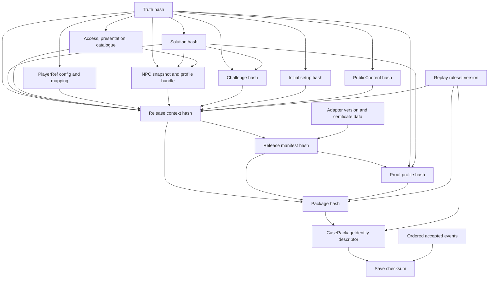

---json
{
  "forgeContractFormat": 1,
  "taskId": "MYST-SESSION-0001C",
  "contractVersion": 2,
  "baseCommit": "3d7545d843883418348004e68717399a64da7a7d",
  "dependencies": [
    {
      "taskId": "MYST-SESSION-0001A",
      "acceptedCommit": null
    },
    {
      "taskId": "MYST-SESSION-0001B",
      "acceptedCommit": null
    }
  ],
  "scope": {
    "create": [
      "src/domain/case-session-save.ts",
      "tests/case-session-save.test.ts",
      "tests/case-session-replay.generated.test.ts",
      "tests/case-session-save.typecheck.ts"
    ],
    "modify": []
  },
  "requiredChecks": [
    {
      "name": "typecheck",
      "command": "npm run typecheck"
    },
    {
      "name": "test",
      "command": "npm test"
    }
  ],
  "mutationSmoke": "required"
}
---
# MYST-SESSION-0001C — Save / Replay V1

**DRAFT. Nicht registriert, nicht freigegeben, auf dieser Basis nicht startbar. Kein Implementierungsauftrag durch dieses Lab.**

**REVISION 2 — Integration Candidate (MYSTERY-FINAL-CONTRACT-INTEGRATION, 2026-10-04).** Vorgänger: `MYST-SESSION-0001C.contract.DRAFT.md` (Branch `forge/owner/audits/MYSTERY-SESSION-PRODUCTION-PACKAGE` @ `b94db40e34a8`, Roh-SHA-256 `6263e005e637bc57f15bdac21e8dd1abb22ece34fbf831573c370d5e213e3205`, forge-contract-v1 `fba5aa67f1cf3e1f1910ed361a8e1d00051ed800fb4c2fb82e04bdd0635c07de`), unverändert archiviert. Owner-Entscheidungen D1–D10 (FORGE-MYSTERY-FINAL-OWNER-RECONCILIATION) sind angenommen. Integriert ausschließlich: die gemeinsamen §§2–11 bytegleich zu MYST-SESSION-0001A v2 (hier normativ: SC §§8–9 inkl. B.12 Public-Load-Fassade, R07 Save-Autorität, PublicContent-Invalidierung). Neue Fälle C41/C42. Jede Änderung ist im MYSTERY-FINAL-CONTRACT-MANIFEST.json als exakter OLD→NEW-Eintrag mit Herkunft belegt. Nicht registriert, nicht freigegeben, keine Implementierungsfreigabe. Registrierung nach Forge BOOTSTRAPPED als Format 2 (Transkodierung ohne Versionssprung).

Gepinnte Contract-Identitäten dieser Integration (Design-/Start-Gate-Pins; `acceptedCommit` bleibt null bis zur Annahme):

| Task | Artefakt | Profil | contentHash |
|---|---|---|---|
| MYST-SESSION-0001A | `MYST-SESSION-0001A.contract.CANDIDATE-v2.md` | forge-contract-v1 (v2) | `f48559e0ba61ed88071dbde6c9ee7895736e9aea1c1db5b8ce839f986def7a6d` |
| MYST-SESSION-0001B | `MYST-SESSION-0001B.contract.CANDIDATE-v2.md` | forge-contract-v1 (v2) | `deeeef0589080ae15f51ca56110f9cdfd27f9af8a40c8d05ef74cd1e7fd1bacb` |


## Verbindlichkeit und Startgate

Dieser Contract verwendet ausschließlich das heute akzeptierte Format 1. dependencies.acceptedCommit=null ist absichtlich ungelöst, kein Dummy-Pin. Vor Architekturfreigabe alle Abhängigkeiten tatsächlich akzeptieren, Commits pinnen und baseCommit/contractVersion nach erneuter API-Prüfung revidieren. MYST-0001 ist `MYST-0001-PLAYERREF-V1.contract.DRAFT.md` (Format 2, contentHash `forge-contract-v2` `f4d3185898015901fad3155fdc37836652c486b028b30528ca4beb17f3726335`). Der Ref-Adapter ist in §2 (PackageRefSource) festgelegt. Task-ID nicht extern reserviert. Alte Scratch-Mocks sind kein Produktionsersatz.

Normativ sind die taskeigene Testmatrix und der eigene Owner-Teil der gemeinsamen Abschnitte: SA §§2–3 (Packageidentität, JSON-Profil, PlayerKnowledge, PublicContent, Release→Proof-Adapter), SB §§4–7 (Events, Reducer, Terminal, Replay, Session-Limits), SC §§8–9 (Savewire, Checksum, Decode, Compatibility, Save-Limits, öffentliche Load-Fehler). §§10–11 gelten gemeinsam, die Limits gehören jeweils dem Owner-Abschnitt. Gleichlautende Kopien in den anderen Dateien sind informativ; weichen sie ab, ist eine Revision nötig, es gibt keinen stillen Vorrang. Nur der im Frontmatter aufgeführte Scope wird implementiert; gemeinsam beschriebene andere Taskteile werden importiert, nicht dupliziert. Keine bestehenden Dateien verändern. Neue Runtime- oder Dev-Dependencies verboten. Kein Import aus src/forge. Vorhandenes zod/node:crypto genügt.

## Ziel, API und Abgrenzung dieses Tasks

Implementiere ausschließlich encodeSessionSave und decodeSessionSave sowie SAVE_LIMITS und die Resulttypen. A-JSON-Helfer und B-replaySession importieren. Kein zweiter Reducer oder eigener Verdictalgorithmus. Untrusted Eingang ist ein begrenzter String, kein frei ausführbares Objekt. Saveformat bleibt strict/canonical und hat exakt die vier Rootfelder.

## Reads / Source of truth

Aktueller main: src/domain/case-truth.ts, case-truth.identity.ts, case-semantics.ts, case-solution.ts, case-solution.identity.ts, npc-knowledge.ts, npc-knowledge.projection.ts sowie bestehende zugehörige Tests. Draft-Inputs: MYST-0002 FINAL CANDIDATE; MYST-0003; MYST-0004 vom 2026-10-04; MYST-0005A/B; MYST-CHALLENGE-0001; MYST-SOLVABILITY-0001. Die exakten SHA-256 der gelesenen Texte stehen im Evidenceinventar. Vor Start gelten akzeptierte Quellen statt dieser Draftannahmen; Abweichung → Contractrevision, keine API-Erfindung.

## 2. Package Identity

PROPOSED normativ: Eine Session ist exakt an EIN unveränderliches Package, EINE Challenge, EINE Presentation-Sprache und EINEN Ruleset gebunden. Der Host wählt das Package. Ein Save wählt keinen beliebigen Pfad, URL, Modulnamen oder ausführbaren Resolver.

```ts
type CasePackageIdentity = Readonly<{
  schemaVersion: 1;
  packageHash: string; // 64 lowercase hex
  rulesetVersion: "mystery-session-v1";
}>;
type EntityRef = {kind:"person"|"location"|"item"|"event"|"evidence"; id:string};
type InitialSetup = {
  schemaVersion:1;
  known: readonly EntityRef[]; // unique set; existing entities
};
// Trusted Adapter um MYST-0001 v1; keine eigene Ref-Ableitung:
type PackageRefSource = {
  caseId:string; truthHash:string;
  config:{profile:"forge-mystery-playerref-v1"; saltHex:string}; // saltHex = exakt der an buildPlayerRefIndex übergebene refSalt
  refFor(kind:EntityRef["kind"],id:string):string|null;
  resolve(ref:string):ResolvedEntity|null; // MYST-0001-Typ, gebrandete IDs
};
```

PackageRefSource ist ein synchroner vertrauenswürdiger Adapter um den PlayerRefIndex aus MYST-0001. Konstruktion: Der Host parst die Truth mit `parseCaseTruth` und ruft dann `buildPlayerRefIndex(truth, refSalt)` auf. `REF_SALT_INVALID` ergibt ein Paket-Finding `SHAPE`, `REF_COLLISION` ein Paket-Finding `REF_MAPPING`; in beiden Fällen entsteht kein Package, Kollisionsdetails gehen nur in den Autorenlog. Bei Erfolg gilt: `caseId = index.caseId`, `truthHash = index.truthHash`, `config = {profile: index.profile, saltHex: refSalt}`, `refFor = (k, id) => playerRefFor(index, k, id)`, `resolve = r => { const x = resolvePlayerRef(index, r); return x.success ? {kind: x.kind, id: x.id} : null; }`. Der Salt ist Autoreneingabe des Falls (MYST-0001 D2), wird vom trusted Packageprovider neben dem Packageinput geliefert und erscheint nie in Event, Save oder Public DTO. Die Session rotiert keinen Salt: Refs ändern sich genau dann, wenn refSalt, caseId oder truthHash sich ändern (MYST-0001 AC-06/AC-07); ein neuer Salt ist eine Autorenentscheidung und ergibt über refsHash ein neues Package (A36). Ein gültiges syntaktisches Token beweist keine Autorisierung.

Ergänzung (Package/Replay-Closure R01, normativ): The trusted provider parses Truth and calls MYST-0001 `buildPlayerRefIndex(truth,refSalt)`. saltHex is that exact input, never inferred from mapping. Validate caseId/truthHash, complete five-kind entity membership, exact forward mapping and reverse resolution. Copy verified mapping into immutable owned artifacts. Salt invalid → SHAPE, collision/incomplete mapping/wrong inverse → REF_MAPPING, no partial package. Salt/config never go in Save/Event/public DTO. Refer to MYST-0001 D2–D5; no alternate derivation. Resolution is identity only, never prefix-Known authorization.

```ts
type CasePackageInput = {
  schemaVersion:1; rulesetVersion:"mystery-session-v1";
  truth:unknown; solution:unknown; access:unknown; presentation:unknown;
  catalogue:unknown;
  npcs:readonly {snapshot:unknown; profile:unknown}[];
  initial:InitialSetup; challenge:unknown; publicContent:unknown; // strict PublicContent
  proof:null|{profile:unknown; releaseManifest:string};
};
// Trusted-only; output of resolveCasePackage, deeply readonly.
type ResolvedCasePackage = {
  identity:CasePackageIdentity;
  truth:CaseTruth; solution:CaseSolution;
  access:EvidenceAccessMap; presentation:EvidencePresentation;
  catalogue:QuestionCatalogue;
  npcs:readonly {snapshot:NpcKnowledgeSnapshot; profile:InterrogationProfile}[];
  initial:InitialSetup; challenge:AccusationChallenge; publicContent:PublicContent;
  proof:null|{profile:CaseProofProfile; releaseManifest:string; releaseHash:string};
  refs: {caseId:string; truthHash:string; // = source.caseId/truthHash, beim Resolve gegen Truth geprüft
         refFor(kind:EntityRef["kind"],id:string):string|null;
         resolve(ref:string):ResolvedEntity|null}; // strukturell PlayerRefTranslator (MYST-0004 §5.1, MYST-0005B §5.1)
};
type PackageFinding = {code:"SHAPE"|"BINDING"|"REFERENCE"|"REF_MAPPING"|
 "LIMIT"|"PROOF_BINDING"; path:readonly(string|number)[]};
resolveCasePackage(input:unknown, source:PackageRefSource):
 | {ok:true; package:ResolvedCasePackage}
 | {ok:false; findings:readonly PackageFinding[]};
```

Resolver-Schritte: Bytes/Tiefe/Knoten sowie Rohzählungen der Root-Collections (Entities 256, Evidence 64, NPCs 16, Fragen 128) vor jedem Zod-Parse und vor der Semantic Validation prüfen (LIMIT); dann Truth/Solution mit echten Parsern parsen; Semantic Validation muss für Veröffentlichung eine leere findings-Liste haben (das heutige SemanticFinding hat kein severity-Feld) (dieser Package-Resolver ist keine neue Semantik-Engine); Draft-Parser für Access, Presentation, Catalogue, NPC-Profile/Snapshots und Challenge verwenden; PublicContent mit dem strikten PublicContent-Schema dieses Contracts prüfen. Alle Bindungen tatsächlich neu berechnen. Je NPC genau ein Profil + Snapshot mit derselben npcId; Duplikate ablehnen, leere NPC-Menge für technische Cases erlaubt. NPCs müssen existieren, aber nicht alle Personen müssen NPCs sein. Initial known muss vollständig referenzvalidiert sein; leere Menge erlaubt. Jeder initial bekannte Evidence-Ref bedeutet hier nur Awareness, KEINE Discovery und KEINE Inhaltsfreigabe.

Ref-Tabelle einmal für alle fünf Entity-Arten bauen. Jedes Ergebnis muss dem in 4/5B vorgeschriebenen Muster entsprechen, global injektiv sein und durch source.resolve exakt auf kind/id zurückführen. Unvollständige Tabelle, Kollision und falsche Rückauflösung sind Packagefehler. Kopierte Tabellen werden eingefroren; spätere source-Mutation oder Portwechsel wirkt nicht auf ein bereits aufgelöstes Package. Die Produktionsintegration darf einen anderen Ref-Namespace nur als neues Package laden.

Kein CasePackageIdentity.caseId nötig: der vollständige Identitätshash bindet es transitiv. Dadurch braucht der Save keine potentiell sprechende Case-ID oder private Solution-/Component-Hashes. Der Host kann außerhalb des Save einen menschenlesbaren Titel anzeigen. Packageidentity ist kein Geheimnis und keine Signatur.

PublicContent (Package/Replay-Closure R03 = Master B.5, Owner SA §2 gemäß D9/D10). Exact shape: `{schemaVersion:1,title:string,brief:string,challengeQuestion:string,labels:{entity:EntityRef,label:string,role:string|null}[],questionTexts:{npc:string,questionId:string,text:string}[],publicRules:{id:string,text:string}[]}`. No extra fields. Texts ≤1000 UTF-16, brief ≤4000 per accepted Master B.5; no normalization. Labels entity-unique and existing; questionTexts exactly authored NPC-profile rule question pairs with existing catalogue questions; publicRules id-unique. All SET by explicit keys in registry. `publicContentHash = H("forge-session-public-content-v1", normalizedPublicContent)` becomes mandatory input to releaseContextHash. PublicContent alone owns public brief/title/label/role/question/rule wording; EvidencePresentation owns evidence text/reports. Public entity labels are exposed only through prefix-Known. Every text byte change changes package and invalidates old save, even a typo. Weitere Grenzen (max 256 Labels, 2048 questionTexts, 64 publicRules, Regel-ID-Muster, MYST-0004 PlayerText T2–T6) und Reviewpflichten: Anhang forge-release-proof-v1 §1. Spielerausgaben verwenden ausschließlich PublicContent plus Known; ein Label einer nicht bekannten Entity wird nie ausgegeben. Kein Roster und kein Briefing aus Truth.

Exakte Auflösung (Package/Replay-Closure R05, normativ): Descriptor stays exactly `{schemaVersion:1,packageHash:64lowerhex,rulesetVersion:"mystery-session-v1"}`. Host lookup by full descriptor retrieves exact immutable content, not latest by caseId/revision. Resolve parses and verifies all actual artifacts and every binding and recomputes the final descriptor. Exact comparison precedes success. Missing/extra/duplicate components or mixed NPC pairs fail atomically; no partial ResolvedCasePackage. Proof is either null with both aggregate proof hashes null, or complete profile+manifest, exact release binding. No revision-only/same-case substitution, digest-only phantom content, cached mutable provider or fallback to another locale. Store immutable verified binding owning all parsed artifacts and copied ref mapping. Preserve existing authored revision fields inside component hashes; add no duplicate component revisions to descriptor.

### Komponenten und kanonische Identität

H(tag,x) = SHA-256 UTF-8(tag + LF + C(x)). C ist ein NEUES strukturelles JSON-Profil: Objektschlüssel rekursiv nach UTF-16-Codeeinheiten sortieren; Arrays in ihrer vorhandenen Reihenfolge erhalten; JSON.stringify-Primitivdarstellung, kein Whitespace, keine Normalisierung, nur wohlgeformte Unicode-Strings und endliche sichere Integer für die hier neu eingeführten Zahlen. Ein globales „alle Arrays sortieren“ ist für Save/Witness falsch. Mengen werden ausschließlich an den folgenden typisierten Grenzen vorher sortiert und auf Duplikate geprüft.

| Komponente | Autoritative Bytes / Normalisierung |
|---|---|
| truthHash / solutionHash | existierende hashCaseTruth / hashCaseSolution unverändert; diese behandeln ihre Domainarrays als Mengen |
| accessHash / presentationHash | jeweiliger Draft-Hash; Presentation.text vollständig enthalten |
| catalogueHash / profileHash | hashQuestionCatalogue / hashInterrogationProfile; keine eigene Kopie dieser Kanonisierung |
| snapshotHash | Hash entire output of the real bound snapshot parser with `H("forge-npc-snapshot-v1", {...snapshot,awareness:sortByC(snapshot.awareness),attitudes:sortByC(snapshot.attitudes)})`. Sort copies by UTF-16 code units of C(entry). awareness and attitudes are SET; all other snapshot fields in V1 are scalars/strict objects. Include schemaVersion, npcId, revision, asOf, caseId, truthHash, solutionHash including null, acquiredAt, all provenance variant fields and full stance/leaning. Parser's subject/structural-statement duplicate and epistemic constraints stay authoritative. Do not discard metadata because a particular response is unchanged. (R02) |
| npcBundleHash | NEW H("forge-session-npcs-v1", nach npcId sortierte Einträge {npcId,snapshotHash,profileHash}); npcId unique |
| initialHash | NEW H("forge-session-initial-v1", initial mit known nach kind/id sortiert) |
| challengeHash | NEW H("forge-session-challenge-v1", Challenge mit allowedClaims als SET nach C(claim) sortiert, der strukturellen Claimidentität; false/undetermined Mitglieder bleiben erhalten, Status wird nie zum Filtern verwendet (R04, D10)); Challenge-Draft hat noch keinen Hash |
| refsHash | NEW H("forge-session-refs-v1", {config,caseId,truthHash,mapping}); mapping ist die vollständige nach kind/id sortierte {kind,id,ref}-Tabelle. Verwendet die tatsächlichen PlayerRef-Ausgaben, keinen angenommenen Algorithmus. |
| publicContentHash | NEW H("forge-session-public-content-v1", publicContent with labels by kind/id, questionTexts by npc/questionId, publicRules by id, strict duplicate rejection) |
| releaseContextHash | NEW H("forge-session-release-context-v1", {rulesetVersion,truthHash,solutionHash,accessHash,presentationHash,catalogueHash,npcBundleHash,initialHash,refsHash,challengeHash,publicContentHash}) |
| releaseHash, falls proof vorhanden | NEW SHA-256 UTF-8("forge-session-release-v1\n" + releaseManifest). releaseManifest ist kanonisches JSON C mit festem Envelope {schemaVersion:1,releaseContextHash,adapterVersion,certificateData}; kein packageHash/proofHash, kein ausführbarer Code. certificateData ist strikt typisiertes authoring JSON nach dem Anhang forge-release-proof-v1, KEINE ausführbare Runtime-Policy und keine Solvability-Autorität. Das Manifest ist ein kanonischer UTF-8-String und wird direkt gehasht, nicht ein zweites Mal JSON-quotiert (R04). |
| proofHash | NEW H("forge-session-proof-v1", vollständiges geparstes ProofProfile). Proof SET paths are answerScope, observations, nodes, edges, edges[].allOf, observations[kind=PUBLIC_RULE].rules and those rules[].allOf; witnessStepIds is ORDERED (R04). Keine weitere Mengennormalisierung; die Hash-Profil-Registry unten ist pfadgenau normativ. |
| packageHash | NEW H("forge-case-package-v1", {schemaVersion:1,rulesetVersion,releaseContextHash,releaseHash:null|string,proofHash:null|string}) |

Hash-DAG: Komponenten → releaseContextHash → releaseManifest/releaseHash → ProofProfile.bindings.releaseHash → proofHash → packageHash. Kein Packagehash im eigenen Input, kein Identity-Hash im PlayerRef-Adapter-Input dieses Contracts. Falls der tatsächliche PlayerRef-Draft eine vollständige Packagehash-Abhängigkeit verlangt, ist das ein expliziter Reconciliation-Blocker: vor Start muss ein vorgelagerter, eigenständiger Ref-Namespace vereinbart werden. Nicht durch einen Fixed-Point-Hash oder leeren Dummyhash umgehen.

### Hash-Profil-Registry V1 (normativ, Package/Replay-Closure R04)

The full path-specific registry below is authoritative. Proof SET paths are answerScope, observations, nodes, edges, edges[].allOf, observations[kind=PUBLIC_RULE].rules and those rules[].allOf; witnessStepIds is ORDERED. Challenge allowedClaims is SET sorted by C(claim), which is the structural claim key here; status is never used for filtering. refs mapping sorted by kind/id includes exact profile/salt; NPC bundle by npcId; PublicContent arrays by explicit keys. CertificateData arrays remain ORDERED under C, including steps and observation mapping data; do not apply domain all-array-SET canonicalizer. releaseHash hashes the exact canonical manifest bytes, without double JSON quoting. Hash fields are labeled scalar hex inputs, not opaque concatenation. Maschinenlesbare, pfadgenaue Fassung: `hash-profile-registry.json` (Branch `forge/owner/audits/MYSTERY-PACKAGE-REPLAY-BINDING-CLOSURE` @ `7ffa39c86755`, SHA-256 `91d077d8a99eea1c156d9df52b69530ea42be45fc23d0ea5c6b51ad4dc2f39c0`); bei Abweichung zwischen dieser Tabelle und jener Datei ist eine Revision nötig, kein stiller Vorrang.

| Component | Owner | Version/profile | Arrays | Binding | Consumer | Save |
|---|---|---|---|---|---|---|
| CaseTruth | TASK-0001 / existing domain | forge-case-c14n-v1 | all arrays: SET sorted by recursively canonical JSON; existing parser validity/duplicate policies unchanged | self-contained | all bound parsers, private semantics, PlayerRef | transitively invalidates exact package |
| CaseSolution | TASK-0003 / existing domain | forge-solution-c14n-v1 | all arrays: SET sorted by recursively canonical JSON | caseId, truthHash | NPC binding, challenge, verdict, proof | transitively invalidates exact package |
| Evidence Access | MYST-0003 | forge-evidence-access-c14n-v1 | entries: SET; entries[].access.paths: SET | caseId, truthHash | investigation | transitively invalidates exact package |
| Evidence Presentation | MYST-0004 | forge-evidence-presentation-c14n-v1 | entries: SET; entries[].mentions: SET; entries[].reports: SET | caseId, truthHash | releaseEvidence, PlayerKnowledge, proof adapter | transitively invalidates exact package |
| QuestionCatalogue | MYST-0005A | forge-interrogation-catalogue-c14n-v1 | questions: SET; questions[].mentions: SET | caseId, truthHash | question availability, interrogation | transitively invalidates exact package |
| InterrogationProfile | MYST-0005A | forge-interrogation-profile-c14n-v1 | rules: SET; rules[act=answer].reveal: SET | caseId, truthHash, catalogueHash, npcId | interrogate | transitively invalidates exact package |
| NPC Knowledge Snapshot | Session A §2; parser TASK-0004 | forge-npc-snapshot-v1 | awareness: SET sorted by C(entry), subject unique per parser; attitudes: SET sorted by C(entry), structural statement uniqueness per parser; all other fields: no arrays in V1; strict schema rejects new array fields | caseId, truthHash, solutionHash or null, npcId | NPC projection, interrogation replay | transitively invalidates exact package |
| NPC bundle | Session A §2 | forge-session-npcs-v1 | root: SET sorted by npcId; duplicate NPC id rejected | all verified snapshotHash/profileHash pairs | release context | transitively invalidates exact package |
| Player Setup / initial awareness | Session A §2 | forge-session-initial-v1 | known: SET sorted by (kind,id); duplicate entities rejected | entity membership in exact Truth; T transitively in release context | initialPlayerKnowledge, prefix authorization | transitively invalidates exact package |
| Challenge | Session A §2; parser MYST-CHALLENGE-0001 | forge-session-challenge-v1 | allowedClaims: SET sorted by C(claim); exact structural claim key; false/undetermined members retained | caseId, truthHash, solutionHash | evaluateChallengeAccusation | transitively invalidates exact package |
| PublicContent | Session A §2 per accepted D9/D10 and Master B.5 | forge-session-public-content-v1 | labels: SET sort by entity.kind then entity.id; questionTexts: SET sort by npc then questionId; exactly the authored profile-rule question pairs; publicRules: SET sort by id | entity membership, NPC/profile/catalogue question membership, initial Known for display authorization | public labels/brief/question/rule/role wording; never derive display roster from Truth | transitively invalidates exact package |
| PlayerRef derivation | MYST-0001 D2–D5 | forge-mystery-playerref-v1 | none: preimage is string; kind encoding is exact enum token | salt:32 lowercase hex nonzero, profile pin, caseId, truthHash, kind, canonical id membership | refFor/resolve translation only | transitively invalidates exact package |
| PlayerRef config + complete mapping | Session A §2 | forge-session-refs-v1 | mapping: SET sort by kind then id; complete five-kind membership; globally injective; no duplicate entity/ref | exact salt used in real buildPlayerRefIndex, pinned derivation profile, all recomputed refs and reverse resolutions | immutable package ref adapter, release context | transitively invalidates exact package |
| Release context | Session A §2 | forge-session-release-context-v1 | none: hash values are scalar lowercase hex strings | all listed verified component hashes; no missing default | release manifest binding | transitively invalidates exact package |
| Release manifest / proof adapter data | Session A §2 per D9; runner in case acceptance | forge-session-release-v1 | certificateData.steps: ORDERED; certificateData.observations and every remaining certificate-data array: ORDERED under C; authored IDs unique; no generic set normalization; manifest: a canonical UTF-8 string, hashed directly; NOT JSON-quoted a second time | releaseContextHash, adapterVersion="forge-release-proof-v1", exact certificateData incl authored mapping/license/rule meanings | CaseProofProfile.bindings.releaseHash, release-to-proof case acceptance | transitively invalidates exact package |
| Proof Profile | Session A §2; schema MYST-SOLVABILITY-0001 | forge-session-proof-v1 | answerScope: SET C-sort; observations: SET C-sort after nested normalization; nodes: SET C-sort; edges: SET C-sort after allOf normalization; edges[].allOf: SET C-sort; observations[kind=PUBLIC_RULE].rules: SET C-sort after allOf normalization; observations[kind=PUBLIC_RULE].rules[].allOf: SET C-sort; witnessStepIds: ORDERED; strict authored IDs; never sort | caseId, truthHash, solutionHash, releaseHash | Solvability case acceptance; not runtime proof gate | transitively invalidates exact package |
| Package hash | Session A §2 | forge-case-package-v1 | none: proof null means both releaseHash/proofHash null; no empty or omitted surrogate | release context, proof closure or paired null | CasePackageIdentity | transitively invalidates exact package |
| Session Save checksum | Session C §8 | forge-session-save-v1 | events: ORDERED accepted events; events[type=accuse].literals: ORDERED input literals; structural duplicates rejected by Accusation parser; other event fields: strict closed shapes | exact full descriptor, event sequence, save schema version | decode then replay | checksum is integrity, not authenticity |

Identitäts-DAG (azyklisch; kein packageHash→PlayerRef, kein proofHash im Manifest, kein Selbsthash):



ResolvedCasePackage ist kein Transport-DTO. Funktionen und private Dokumente gehen nie an UI oder Save. Der Factory-Output erhält eine toJSON-Methode, die wirft; strukturierte Clones scheitern an Funktionen. Das ist Unfallschutz, keine Sandbox gegen vertrauenswidrigen Hostcode. Public output wird aus einem eigenen Allowlist-DTO konstruiert.

### Proof-Bindung ohne vorgetäuschte Zertifizierung

Package A parst das ProofProfile mit dessen echtem Parser, prüft T/S-Bindungen, berechnet releaseHash und verlangt dessen exakte Übereinstimmung mit profile.bindings.releaseHash. Im Manifest muss releaseContextHash stimmen. Der Resolver führt certificateData NICHT aus und behauptet niemals „solvable“, nur „gebunden“. proof:null ist für technische Sessiontests zulässig; ein veröffentlichter Vitrine-Slice braucht einen separaten positiven echten Witness-Lauf.

Der Solvability-Port gehört in die Fall-Abnahme: witnessStepIds → die exakt typisierte Eventtabelle des forge-release-proof-v1-Anhangs → replaySession desselben Packages → tatsächlich freigegebene Payloads und public-law Receipts → ReleasedObservation. Nur der normative Anhang bestimmt die endlichen Selector-/Literal-/Source-Zuordnungen. OBSERVED braucht die explizite authored Faktizitätslizenz und Canonical Consistency; source=observation allein genügt nicht. REPORTED_BY_NPC umfasst die exakt gebundene bejahte/verneinte direkte Aussage oder ausdrücklich authored Evidence-Testimony, nie den internen knowledge/belief-Marker. Uncertainty erzeugt kein Boolean. PUBLIC_RULE braucht den wirklich dargestellten öffentlichen Gesetzestext und qualifizierte Instance-Receipt. Profile.observations sind nur der Erwartungskatalog, niemals Replayausgabe.

Release→Proof-Adapter `forge-release-proof-v1`: normativ ist der folgende Anhang (Owner SA §2 gemäß D9(a); Runner in der Fallabnahme, kein vierter Session-Produktionstask). Änderung von certificateData/Adapterversion invalidiert Package und Save.

### Anhang forge-release-proof-v1 — Release→Proof-Adapter (normativ, Owner SA §2)

Quelle: `SESSION-A-RELEASE-PROOF-ANNEX.md`, Branch `forge/owner/audits/MYSTERY-RELEASE-PROOF-CERTIFICATION-CLOSURE` @ `d17f5211`, SHA-256 `cb0b8ba09731ac6b659e7d9d20cbe37f8f32f6aa90fd2696c85b69017243bf85`. Text unverändert übernommen; nur die Titelzeile entfällt und Überschriften sind um zwei Ebenen abgesenkt. Typbezug (IR-05, Integrations-Klarstellung ohne Semantikänderung): `PlayerReport` und dessen `claim` sind die MYST-0004-v2-Typen (§5.4, drei Claim-Varianten); `PlayerClaim` im NPC-ReportSelector ist der neunvariantige MYST-0005B-v2-Typ (Statement einer InterrogationObservation); die drei gemeinsamen Varianten sind strukturell identisch. `SessionEvent` ist SB §4.

Owner: MYST-SESSION-0001A. Adapter: `forge-release-proof-v1`. This is contract text for review/integration, not a registered implementation contract or an implemented API. It replaces the unresolved certificateData boundary; Session B owns accepted events/replay and Session C owns saves. D8/D9 are accepted by the current Owner instruction. The remaining Master B.2/B.7–B.12 repairs retain their owners and are not silently implemented here.

#### 1. Strict data and authority

`CasePackageInput.publicContent:unknown` is parsed into `PublicContent`; `ResolvedCasePackage.publicContent:PublicContent` is immutable. Strict PublicContent:

```ts
{
 schemaVersion:1;
 title:string; brief:string; challengeQuestion:string;
 labels:readonly {entity:EntityRef; label:string; role:string|null}[];
 questionTexts:readonly {npc:string; questionId:string; text:string}[];
 publicRules:readonly {id:string; text:string}[];
}
```

Texts follow MYST-0004 PlayerText T2–T6, without normalization; max 1000 UTF-16 units, brief max 4000. Labels: max 256, entity unique and existing. Question texts: exactly one per existing `(profile.npcId, rule.questionId)`, no duplicate/unassigned pair; max 2048. Public rules: max 64, unique neutral ASCII IDs `[a-z][a-z0-9:_-]{0,63}`. Only this component owns public title, briefing, question, label, role and rule prose. Player output is constructed from PublicContent and prefix-Known. It never enumerates Truth persons/locations or reads Truth names/descriptions to fill gaps. Labels for unknown entities are omitted. Public rule/brief/question prose must be reviewed for release-phase consistency: it may not name an unreleased entity indirectly. Exact IDs and text bytes, including rule meanings and question texts, are identity-bound.

All publicRules are static authored public laws visible at initial presentation; their text must not contain private graph IDs, hidden answer polarities, hidden case assignments or unreleased names. An instance license below becomes eligible only after its explicit observed inputs. Its private descriptor is interpreted as an instance of this public law. Human review must verify that the text really licenses that exact body and conclusion, including negation, person, time and role. A rule ID by itself is not a semantic license. This is the finite case-specific formalization already required by SOL, not automatic semantic understanding of prose.

`releaseManifest` retains exactly `{schemaVersion:1,releaseContextHash,adapterVersion,certificateData}`. `adapterVersion` is exactly `"forge-release-proof-v1"`. CertificateData is this strict shape:

```ts
{
 schemaVersion:1;
 steps:readonly {stepId:string; event:SessionEvent}[];
 observations:readonly PremiseMap[];
}
```

`steps`: 0..256 ordered entries, unique SOL-local-format stepId; each profile.witnessStepIds entry exactly once and in the same order; no extra unused step. Each event is exactly Session B §4, no `ask`, `read_record`, input seq, proof receipt or canonical-ID alias. Events use this package's real PlayerRefs; initial proof-only step shortcuts are forbidden. The map is private authoring data, not executable code, not a host callback, not a public endpoint.

`observations`: 0..64, IDs unique, exact coverage of profile.observations. Each entry refers to exactly one same-ID expected ReleasedObservation and has its identical kind and literal/entity/rule payload. No unbound `approved`, `reachable`, truth or status field. Profile expectations describe the catalog; they never manufacture releases.

#### 2. Exact finite selectors

Each entry is one of the following; all objects strict. Entity and literal IDs remain private and refer to the same bound T/S. `PlayerReport`, `PlayerClaim` and `SessionEvent` mean the existing current contracts' types, without new aliases.

| PremiseMap kind | Exact fields in addition to id/kind | Meaning |
|---|---|---|
| OBSERVED | `literal:PropositionLiteral; source:{kind:"evidence";evidenceId}; alternatives:readonly {report:PlayerReport;licenseRuleId:string}[]` | One released report from exactly this evidence, with an explicit factivity law. Every alternative retains the same source and same literal. |
| REPORTED_BY_NPC | `npcId; literal:ProofLiteral; alternatives:readonly ReportSelector[]` | The source's report occurred, without asserting that its content is true. |
| ENTITY_AWARENESS | `entity:EntityRef` | That entity is in replay-derived prefix-Known. Never a proposition/role seed. |
| PUBLIC_RULE | `ruleId:string; afterObservations:readonly ObservationId[]; rules:readonly PublicRuleDescriptor[]` | Exact existing SOL descriptors bound to an actually displayed PublicContent law and its qualified private instance receipt. |

Every alternatives list has 1..16 unique entries, compared using C; it is OR over exact **source selectors**, not a new logical rule operator. All alternatives produce the same ReleasedObservation. Different evidence sources require different OBSERVED IDs and existing SOL nodes/edges; substituting a source under the same root is forbidden. Independent proof routes are represented by SOL's already-existing licensed edges. No alternative may be inferred from Evidence.links or descriptions.

ReportSelector is strictly either:

```ts
{kind:"npc"; questionId:string; claim:PlayerClaim; stance:"affirms"|"denies"}
| {kind:"testimony"; evidenceId:string; report:PlayerReport}
```

For an NPC selector, npcId resolves to the exact emitting NPC; questionId is assigned to that NPC profile; a replayed ObservationRecord.source must name the same NPC, question and accepted eventIndex. The payload must be `act:"answer"`, the exact claim and exact affirms/denies stance. Statement and mention closure are validated against the immutable package. Leans_affirms, leans_denies, uncertain, does_not_know and decline remain journal entries but are never Boolean ReportSelectors; attempting to map one is a parse error.

For testimony, the exact replayed evidence record must name evidenceId. The exact report must have source `{kind:"testimony",person:playerRefFor(npcId)}`. The literal value equals `(report.stance === "affirms")`. The NPC must be an existing person; receiving a written report does not require its NPC to have been interrogated. An observation-source report cannot satisfy a testimony selector, nor a different person/evidence satisfy the same source. Received provenance remains in PlayerKnowledge even though SOL's existing REPORTED_BY_NPC root stores only npcId/literal. Changing the evidence selector changes releaseHash.

For OBSERVED, source.kind is evidence only in this adapter revision; initial OBSERVED roots allowed by SOL's general schema are unsupported and fail the adapter parse. Awareness and public laws can be initial. No invented initial observation mechanism is supplied. Each report.source is exactly `{kind:"observation"}`. Its polarity must equal literal.value. licenseRuleId must exist in publicContent.publicRules, be actually displayed in this replay context, and explicitly license this particular observation's factivity. Testimony, raw evidence discovery, labels or NPC knowledge do not satisfy it. Truth consistency is checked separately by SOL against CaseTruth; a valid report receipt alone cannot make a false literal true.

Claim→literal association is explicitly authored, field-complete and validated. For proposition literals, locate the specified proposition ID and compare its existing claim after translating every entity ref via the immutable package mapping. For conclusion literals, locate the specified conclusion ID and do the same. Claim enums, time and role remain exact; comparison never uses only kind/person, first match, loose equality or negation inference. Multiple canonical catalog aliases for a selected structural claim are rejected as ambiguous, even if their current Bool values happen to agree. This is a source/meaning binding check, not a world-truth lookup or automatic extraction. All nine PlayerClaim variants use MYST-0005A statementClaimReferences and existing claim structures; field mapping is person↔personId, location↔locationId, item↔itemId, event↔eventId, causeEvent↔causeEventId, while kind/at/role/value retain their exact values. Correct kind plus exact inverse ref mapping is mandatory. Foreign, stale, noninjective or unknown refs fail privately before replay; resolving a token never grants Known.

For ENTITY_AWARENESS, its exact kind/id must be present through initial known, released Evidence itself or an explicit M4/M5B mention; no traversal of Report.claim, evidence links or NPC private awareness.

For PUBLIC_RULE, descriptors are exactly the existing SOL `{edgeId,allOf,yields}` with referential and license validation from SOL. Every afterObservations ID exists in the same certificate map, refers to a non-PUBLIC_RULE root, and is unique. Empty means initially eligible only if the publicly displayed rule really licenses the specified instance; the Vitrine instances below have nonempty gates. Self-license, rule-to-rule eligibility, private conclusion-status eligibility and implicit proof completion gates are forbidden. Eligibility uses the release receipt set, not canonical answer values. Duplicates and conflicting same-ID payloads fail; no last-writer wins.

#### 3. Receipt, binding and evaluation order

A PublicRuleDto is strictly `{id:string,text:string}` copied from publicContent.publicRules, not a raw graph descriptor. Initial PublicContent rendering and rule receipts are a derived public view, not a new PlayerKnowledge ObservationRecord variant, SessionEvent, or save field. The trusted case-abnahme runner owns transient receipts:

```ts
{ ruleId:string; publicPayload:PublicRuleDto;
  publicContentHash:string; releaseContextHash:string;
  prefixEventCount:number; qualifiedObservationIds:readonly string[] }
```

Receipts and qualifiedObservationIds are INTERNAL/QA and never sent to the player. At prefix zero all static public laws receive display receipts with no qualified instance. After each accepted event, map actual M4/M5B records and Known to non-rule roots, then qualify each PUBLIC_RULE instance whose afterObservations are all received at that same prefix. Record the earliest qualifying prefix and exact public payload. Repeated matching reports do not create extra roots, but their journal records remain. Distinct contradictory reports retain distinct IDs and polarities; neither overwrites nor cancels the other. They become world literals only through an explicit authored public SOL edge whose consequence is independently canonically checked.

The runner first resolves the immutable package, selects the bound certificateData and translates the ordered witnessStepIds to its exact SessionEvents. It calls the real replaySession for that package from initialSession; every event must be accepted in order, including terminal behavior. It then traverses actual accepted-prefix outputs/knowledge and PublicContent display receipts as specified. It never returns profile.observations as a canned replay result and never invokes a fixture callback serialized in authored JSON. The callback supplied to SOL is trusted code and returns only the derived ReleasedObservations and exact ProofBindings `{caseId,truthHash,solutionHash,releaseHash}`. Package-level checking remains binding-only and does not run the certificate or assert solvability.

Missing replay implementation/throw → SOL unknown with REPLAY_UNAVAILABLE. Invalid event/witness → INVALID_WITNESS. A catalogued source not actually observed produces no root; SOL reports PREMISE_NOT_REACHED and fails if a required goal cannot be derived. Invalid/missing catalog source, invalid selector, source conflict, duplicate ID, unresolved alias or foreign binding → private parse/binding error, no fabricated root and no player verdict. Exact replay result with unknown/conflicting root payload → INVALID_REPLAY_RESULT/RELEASE_RECORD_MISMATCH under SOL. Technical errors never become not_solved.

Binding DAG remains acyclic. Add publicContentHash = H("forge-session-public-content-v1", PublicContent with labels by kind/id, questionTexts by npc/questionId, publicRules by id). Include publicContentHash in releaseContextHash. releaseManifest binds actual static laws, exact report selectors, step events and instance descriptors via canonical C. All certificateData arrays remain ORDERED under structural C, including steps, observations, alternatives, afterObservations and rules. Reject semantic duplicates as specified, but never sort or deduplicate these arrays for manifest hashing. OR/conjunction can be order-insensitive for eligibility while array permutations still change releaseHash and package identity. This follows the exact R04 registry at package-binding closure commit 7ffa39c86755259b3055603be6894b2deac01a8c; it creates no new SET override. releaseHash = SHA256("forge-session-release-v1\n" + canonical manifest bytes). profile.bindings.releaseHash must match. proofHash uses existing SOL/SA normalization. packageHash includes releaseContextHash/releaseHash/proofHash. Neither manifest nor its hash input contains packageHash/proofHash; no cycle. All text/ref/salt/snapshot/selector/stance/source/license/step/descriptor changes invalidate exact-package saves. No placeholder hash is accepted as certification. Changing authored selector/source/stance data changes releaseHash; changing the adapter interpretation itself requires a fresh adapterVersion, rulesetVersion and package identity under Session compatibility rules. Initial integration revises the unregistered Session contracts together; no legacy scratch save migration is promised.

#### 4. Minimal Vitrine instantiation

Retain the existing solution, four-role direct_actor scope, evidence and NPC profiles. Build real MYST-0001 refs with this package's bound nonzero refSalt. The historical scratch refs/hashes are not reusable production identities.

| Existing observation ID | Exact evidence / canonical meaning | Law | Instance gate |
|---|---|---|---|
| observed:hof-contact | d03, p18=true, observation report affirms | rule:certified-sources | actual d03 release |
| observed:max | d04, p03=true, observation report affirms | rule:certified-sources | actual d04 report for Max@hof/240 |
| observed:nora | d04, p04=true, observation report affirms | rule:certified-sources | actual d04 report for Nora@hof/240 |
| observed:oskar | d05, p05=true, observation report affirms | rule:certified-sources | actual d05 report for Oskar@archiv/240 |
| public-rule:max | existing exclude:max descriptor | rule:manual-presence | observed:max |
| public-rule:nora | existing exclude:nora descriptor | rule:manual-presence | observed:nora |
| public-rule:oskar | existing exclude:oskar descriptor | rule:manual-presence | observed:oskar |
| public-rule:remaining | existing remaining:lina descriptor | rule:closed-roster | observed:max, observed:nora, observed:oskar |

The original step IDs remain: search-hof → investigate/search_location(hof); ask-nora-photo → interrogate(nora,q08); read-camera → investigate/examine_item(kamera); ask-oskar-record → interrogate(oskar,q14); read-terminal → investigate/examine_item(terminal). `ask-` in a private step ID is not a legacy event alias. Actual events contain real PlayerRefs. The registry, reverse-map, certificateData, ProofProfile and instance-qualified receipts stay private. Public text retains the existing three authored general laws. The d03 root is not a required proof goal; it enables q08 in this authored witness. There is no new clue or general inference engine.

#### 5. Required annex acceptance

A resolver must parse positive and negative fixtures for every selector kind; reject alias/source/binding/stance/duplicate/self-license attacks; compute the acyclic hashes and exact save invalidation; distinguish source missing in a valid witness from malformed authored source. The real case-abnahme runner must demonstrate prefix-derived releases, public-law display receipts, no canned expected roots, source-specific conflicting reports, alternative existing paths, and the independent finite proof checker. The 128-configuration scratch evidence here defines regression cases, not production acceptance. Session B's D8 verdict never reads these receipts or a proof closure.


### Ergänzung: genaue A-Helfer und größenbedingte B/C-Abhängigkeit

PROPOSED normativ. player-knowledge.ts exportiert Typen KnownEntity, ObservationRecord, PlayerKnowledge sowie initialPlayerKnowledge(pkg), recordEvidence(knowledge,observation,eventIndex), recordInterrogation(knowledge,observation,eventIndex). Initial überführt ausschließlich pkg.initial.known mit pkg.refs; recordEvidence nimmt die Evidence selbst und Mentions auf, entdeckt genau einmal; recordInterrogation nimmt ausschließlich Mentions auf und hängt jeden Empfang an. Normiert sind beobachtbare Unveränderlichkeit und unmutierte Caller-Inputs, nicht eine Vollkopie je Event. Frozen Subtrees dürfen geteilt werden. replaySession darf einen privaten Working-State nutzen, wenn Übergänge, Outputs, Limits und Fehlerpriorität exakt reduceSession entsprechen. Veröffentlichte Snapshots und der Endstate bleiben immutable. Sie sind trusted-only und werden erst nach vollständiger Port-/Ref-Validierung von B verwendet. Eine reine helper-Funktion darf keine Eigenautorität zum Evidence-Release erhalten.

case-package.identity.ts exportiert serializeSessionJson(value) für das beschriebene C, hashSessionJson(profile,value) für H sowie die konkreten package-internen Componenthashfunktionen. Keine Nutzung des Truth-Serializers für Historien. Die JSON-Safety-Prüfung validateSessionJson(value,{maxDepth,maxNodes}) arbeitet iterativ und meldet Limit/Shape vor rekursiver Serialisierung; keine Caller-konfigurierbare Semantik, nur die hier festgelegten Konstanten. Sie wird in A/C wiederverwendet und gehört zum A-Zeilenbudget. Plain JSON bedeutet keine Funktionen, undefined, Symbole, BigInt, NaN/Infinity, unsichere Integer, Accessoren, Zyklen oder fremde Prototypen. Fremder ausführbarer JS-Code, der Proxies liefert, ist keine unterstützte untrusted Schnittstelle.

B prüft die prospektive Savegröße ohne Import von C über die exakte Bytelänge, nicht durch Vollserialisierung je Event: B0 = UTF8Length(C({schemaVersion:1,packageIdentity:pkg.identity,events:[],checksum:"0".repeat(64)})). Für n Events gilt B = B0 + Σ UTF8Length(C(event_i)) + max(0,n−1). Keine Rundung oder Approximation; ein abgelehntes Event ändert B nicht. Differential-Tests gegen die Vollserialisierung sind Pflicht; kein persistierter Cache-Owner. C verwendet denselben Serializer und dieselbe Envelopeform. Kein Dependencyzyklus. B kann den Check vor vollständiger Gameplayauswertung ausführen, sobald ein Event geparst ist; die Abnahme/Commitentscheidung bleibt nach allen Portprüfungen atomar.

Strict private Packageinput-JSON may contain proof.releaseManifest as a string. Parse its exact schemaVersion/releaseContextHash/adapterVersion/certificateData envelope and validate certificateData under the normative forge-release-proof-v1 appendix. adapterVersion is exactly forge-release-proof-v1. The resolver validates binding and authoring data but executes neither witness nor SOL checker; only the real case-abnahme runner can produce a certification result.

## 3. PlayerKnowledge

PROPOSED: PlayerKnowledge V1 ist ein quellengebundenes Informationsjournal, kein Set objektiv wahrer Propositionen und keine neue menschliche Logik-Engine.

```ts
type KnownEntity = {kind:EntityRef["kind"]; ref:string;
  firstSeen:{kind:"initial"}|{kind:"event";eventIndex:number}};
type ObservationRecord =
 | {source:{kind:"evidence";eventIndex:number;evidence:string};
    observation:EvidenceObservation}
 | {source:{kind:"npc";eventIndex:number;npc:string;questionId:string};
    observation:InterrogationObservation};
type PlayerKnowledge = {
  schemaVersion:1;
  known:readonly KnownEntity[];
  discoveries:readonly {evidence:string;firstDiscoveryEvent:number}[];
  observations:readonly ObservationRecord[];
};
type VerdictRecord={eventIndex:number;verdict:"solved"|"not_solved"};
type SessionState={identity:CasePackageIdentity;phase:"active"|"solved";
  events:readonly SessionEvent[];knowledge:PlayerKnowledge;
  verdicts:readonly VerdictRecord[]};
```

eventIndex ist nullbasiert im akzeptierten Log. Keine eingehende seq, kein Timestamp, kein Versuchszähler als separate Autorität. Bekannte Entities nach ref sortieren; erste Herkunft bleibt erhalten. Discoveries nach evidence-Ref sortieren; erste Fundaktion bleibt erhalten. Observations chronologisch; bei mehreren Evidence-Funden derselben Aktion nach öffentlichem Evidence-Ref sortieren. NPC-Wiederholungen erzeugen je einen ObservationRecord, weil es zwei Gesprächsereignisse sind. Der Payload bleibt gleich bei gleichen Inputs. Wiederholte Suche erzeugt ein Event, aber keinen zweiten Discovery-/EvidenceObservation-Eintrag. Eine Summary-Ansicht darf identische Berichte gruppieren, bleibt rein abgeleitet.

Nur initial.known, neu veröffentlichte Evidence selbst und observation.mentions vergrößern Known. Kein Nachziehen aus Evidence.source/links, Report.claim, Truth/Eventpartizipanten, Solution, interner NPC-Awareness oder NPC-Provenance. Die Release-Module garantieren Referenzabdeckung; Session verlangt zusätzlich jede freigegebene Mention rückauflösbar, artkorrekt und paketgebunden. Ein referenzierter Report-Claim außerhalb der erlaubten Mentions ist ein Host-Invariantfehler, keine Gelegenheit zum stillen Freischalten.

Observation provenance ist Spieler-Empfangsherkunft: WANN im akzeptierten Log, WELCHE Evidence oder WELCHER NPC und WELCHE Frage. NPC internal provenance (witnessed_event/told_by_person etc.) bleibt privat. EvidenceObservation.reports[].source ist eine freigegebene Aussagequelle und bleibt erhalten, kann aber weder als objective truth noch als interner NPC-Erkenntnisweg verwendet werden. Widersprüchliche NPC-Berichte koexistieren. Leans/uncertain/does_not_know/decline sind jeweils genau der Draft-Payload. Kein automatisches Überschreiben früherer Reports und kein automatischer Faktengewinn.

Keine PlayerKnowledge-Loadfunktion aus untrusted JSON. Verlässlicher Zustand entsteht durch initialSession und Reducer/Replaying. Eine TypeScript-Brand ist nur Typdisziplin, keine Authentisierung. Server-Host bzw. headless Runner verwaltet den Zustand; direkt manipulierter JS-Heap ist außerhalb dieser Vertrauensgrenze.

## 4. Event Vocabulary

PROPOSED exakt drei strikt geparste Shapes, keine optionalen semantischen Felder:

```ts
type SessionEvent =
 | {type:"investigate";action:"search_location"|"examine_item"|"examine_person";target:string}
 | {type:"interrogate";npc:string;questionId:string}
 | {type:"accuse";literals:readonly {claim:PlayerConclusionClaim;value:boolean}[]};
type PlayerConclusionClaim =
 | {kind:"personResponsibleForEvent";person:string;event:string}
 | {kind:"personRoleForEvent";person:string;event:string;role:"direct_actor"|"planner"|"facilitator"}
 | {kind:"noPersonResponsibleForEvent";event:string}
 | {kind:"eventCausedEvent";causeEvent:string;event:string}
 | {kind:"eventIntent";event:string;value:"intended"|"unintended"|"not_applicable"}
 | {kind:"eventMechanism";event:string;value:"ordinary"|"supernatural"|"mixed"};
```

Refstrings erfüllen das Draft-Muster /^pr1_[0-9a-hjkmnp-tv-z]{16}$/. questionId übernimmt QuestionIdSchema aus 5A; keine frei erfundene Frage. Der PlayerConclusionClaim enthält genau die sechs Conclusion-Arten aus dem neunfachen 5B-PlayerClaim. Session überträgt sie feldweise in Canonical-IDs; das ist Transportkonversion, keine neue Statusauflösung. Die sechs Varianten müssen explizit getestet werden. role/value heißen wie im Original; das äußere literal.value bleibt Boolean.

Einzelnes Event ≤16 KiB kanonisches UTF-8; maximal 32 Literale. Claims innerhalb einer Accusation behalten Eingabereihenfolge. Duplikate/Widersprüche derselben Claimstruktur werden durch parseAccusation abgewiesen, nicht zusammengelegt. Keine clientseitigen truthHash/caseId/challengeId/solutionHash-Felder. Leere Anklage ist als syntaktisch gültiges Event zulässig und ergibt abhängig von der echten Challenge/Core-Semantik einen Verdict; keine frei erfundene Sonderregel. Package-Publikation verlangt für den ersten Fall mindestens eine requiredConclusion und nichtleeren Challenge-Scope.

Vorhandensein und Kind jedes Ref müssen passen UND jedes eingehende Entity-Ref muss bereits im Known des Präfixes liegen. Das betrifft auch event/causeEvent in Accusations. Alle gültigen, aber unbekannten Refs werden genauso abgewiesen wie nicht existente Refs. Keine Token-Auflösung gewährt selbst Known. Nicht verfügbare Fragen und unbekannte NPCs ergeben dasselbe öffentliche ACTION_UNAVAILABLE.

## 5. Reducer

```ts
initialSession(pkg:ResolvedCasePackage):SessionState;
reduceSession(pkg:ResolvedCasePackage,state:SessionState,input:unknown):
 | {ok:true;state:SessionState;output:SessionOutput}
 | {ok:false;state:SessionState;code:"ACTION_UNAVAILABLE"|"SESSION_CLOSED"|"LIMIT_REACHED"}
 | {ok:false;state:SessionState;code:"HOST_FAILURE"}; // trusted-only branch
type SessionOutput =
 | {type:"investigate";observations:readonly EvidenceObservation[]}
 | {type:"interrogate";observation:InterrogationObservation}
 | {type:"accuse";verdict:"solved"|"not_solved"};
```

HOST_FAILURE wird im Playertransport in eine allgemeine technische Nichtverfügbarkeit übersetzt, niemals in not_solved oder Domain-IDs. Detaillierter interner Diagnosepfad ist nur für Tests/Hostlog. Resultate sind neu konstruiert und tief readonly/frozen; bei Ablehnung dieselbe unveränderte State-Referenz zurückgeben. Trusted Portthrows können am äußeren Session-Einstieg in HOST_FAILURE gefangen werden; keine behauptete Isolation bösartigen Hostcodes.

Normative Reihenfolge: (1) Package-/Stateidentity prüfen → HOST_FAILURE. (2) solved → SESSION_CLOSED für jede Eingabe, ohne irgendeinen Gameplayport aufzurufen. (3) Historylimit → LIMIT_REACHED. (4) Raw-Event-Limits und Shape; Refauflösung, Kind und prefix-Known. (5) Ports synchron auf temporärem Zustand auswerten. (6) alle Releases, Refbindings, Outputlimits und vollständigen Prospective-Save-Bytes prüfen. (7) einmal atomar neuen State und Event publizieren. Fehler in einem von mehreren Releases führt zum vollständigen Rollback, einschließlich Known und Discovery.

investigate: target auflösen; exakte Canonical-Action mit locationId/itemId/personId aufbauen; known als Canonical EntityRef[] aus dem Präfix; resolveInvestigation verwenden. Neue IDs = found minus discoveries. Found muss existierende Evidence sein; Übersetzung vor öffentlicher Sortierung. Für alle neuen IDs `releaseEvidence(pkg.presentation, id, pkg.refs)` aufrufen, deren Output validieren; erst dann Evidence+Mentions und Records übernehmen. Leere Ergebnisse und bereits komplett entdeckte Suchresultate sind akzeptierte Aktionen. Keine cascading Investigation in derselben Aktion: ein dadurch bekannt gewordenes Item verlangt ein nächstes Event.

interrogate: `pkg.refs.resolve(npc)` muss `{kind:"person", id}` ergeben, und `npc` muss im Präfix-Known liegen; gebraucht wird der npcs-Eintrag mit `snapshot.npcId === id`, sonst ACTION_UNAVAILABLE. `known` = für jedes Präfix-`KnownEntity` `pkg.refs.resolve(k.ref)`; das Ergebnis darf nicht null sein und muss `k.kind` entsprechen, sonst HOST_FAILURE. Übergeben werden kanonische `EntityRef[]`, nicht `KnownEntity`. Aufruf: `interrogate({truth:pkg.truth, solution:pkg.solution, snapshot, catalogue:pkg.catalogue, profile, refs:pkg.refs, known, questionId})`. QUESTION_NOT_AVAILABLE wird ACTION_UNAVAILABLE; Binding/Ref-Fehler werden HOST_FAILURE. Erfolgreiche decline/does_not_know sind akzeptierte Beobachtungen, keine Fehler. Der Reducer liest nie internen NPC-Stance zur eigenen Antwortentscheidung.

accuse: alle Claims übersetzen, parseAccusation({schemaVersion:1,caseId:pkg.truth.caseId,truthHash:pkg.refs.truthHash,literals},pkg.truth) (der beim Resolve gebundene unveränderliche Truth-Hash, einmal berechnet), dann evaluateChallengeAccusation mit exakt pkg.challenge. Gültiges not_solved wird geloggt und lässt phase active. solved wird geloggt, phase solved. Technische Core-/Challengefehler werden nicht als Fehlanklage verschleiert. Es gibt keinen frei wählbaren Core-only-Modus.

Terminal: nach dem ersten solved keine weiteren akzeptierten Events, auch keine Beobachtungen, Fehlanklagen oder leeren Suchen. Views/Save dürfen weiter gelesen werden. Replay eines Logs mit Events nach solved ist INVALID_HISTORY; niemals abschneiden. Wiederholtes Event bedeutet keine Netzwerk-Retry-Idempotenz. Ein eventId-/Idempotency-Key-Feature gehört nicht in V1; ein Transport muss unbestätigte Requests bewusst behandeln.

## 6. Challenge Integration

DESIGN INPUT + PROPOSED: Der Spieler liefert die Antwort, der Host wählt die Challenge. Ein Package enthält genau eine Challenge. Dadurch braucht accuse kein challengeId und kann nicht auf einen leichteren Scope umschalten. Derselbe Truthzustand mit anderer Challenge oder Solution erhält anderen packageHash und inkompatiblen Save.

Challenge-Result solved ist die einzige technische Siegbedingung im V1-Sessionloop. Known autorisiert verwendete Entitäten, aber nicht die Wahrheit der Behauptungen. Kein Nachweiszwang, keine inferred journal facts, keine Solvability-Abfrage pro Anklage. Undetermined ist weiterhin ein legitimer Core-Status, der im Challenge-Wrapper eine eingereichte Antwort nicht erfüllt.

OWNER D8 ACCEPTED: Vitrine V1 uses the Session-V1 victory condition. Correct complete four-part direct_actor answer = solved, without collected evidence, NPC statement, proof receipt or citation gate. Evidence remains deduction assistance. The Vitrine UI convention maps a selected one of the four public candidates to that candidate true and the other three false, with all four literals submitted in accuse. No new Session action or answer-scope toggle. Mandatory proof submission in a future version requires its own Challenge-Policy contract and is outside this task.

EXPERIMENTALLY VERIFIED im Scratch-Modell: Die richtige vollständige Antwort kann im Initialzustand solved ergeben. Das ist kein Replayfehler, sondern die konkrete verbleibende Produktentscheidung. Brute-force über mehrere komplette Antworten wird weder durch neutrale Core-Truth noch durch Exactness allein verhindert. Für den ersten Slice akzeptabel nach expliziter Case-Spec-Korrektur; kein Anti-Cheat-Claim.

## 7. Interrogation Replay

PROPOSED: Jeder Replay beginnt mit initialSession desselben aufgelösten Packages. NPC, questionId und Known werden aus Event und Präfix rekonstruiert. Bei jedem akzeptierten interrogate läuft die echte 5B-Pipeline erneut: projectNpcKnowledgeWithBridge → decideResponse → ReleaseTranslator → InterrogationObservation. Bridgeobjekte sind frisch und bleiben transient. Kein VisibleRef, kein lokaler Index, kein ResponseDecision, keine frühere Antwort und kein NPC-Provenance-Dump wird persistiert.

Snapshots ändern sich in diesem V1 nicht mit Sessionevents. asOf ist der im Package eingefrorene NPC-Zeitpunkt, keine Sessionuhr. Player-Known beeinflusst Askability; es überschreibt nicht NPC-Wissen. Zwei Replays mit denselben Komponenten und demselben Ruleset müssen dieselben Antworten liefern. Ein verändertes NPC-belief, eine Revision, ein Provenancefeld oder ein Profil erzeugt neue Identität; auch wenn einzelne Antworten zufällig gleich bleiben. Keine heuristische Rückwärtskompatibilität.

```ts
replaySession(pkg:ResolvedCasePackage,events:unknown):
 | {ok:true;state:SessionState}
 | {ok:false;code:"INVALID_HISTORY"|"LIMIT_REACHED"|"HOST_FAILURE";
    eventIndex:number|null};
```

Replay prüft zunächst Collection-/Bytelimits, dann denselben Reducer in Reihenfolge. Beim ersten abgewiesenen Event abbrechen; keine Teilzustände an Spieler und keine Fortsetzung hinter einem ungültigen Präfix. eventIndex ist eine interne Diagnose und wird nicht mit privaten Codes öffentlich erklärt. Replay verschluckt abgewiesene Events NICHT. Ein akzeptiertes Log enthält definitionsgemäß nur Inputs, die damals am jeweiligen Präfix akzeptiert wurden.

## 8. Save Format

PROPOSED normativ:

```json
{"schemaVersion":1,"packageIdentity":{"schemaVersion":1,"packageHash":"<64hex>","rulesetVersion":"mystery-session-v1"},"events":[],"checksum":"<64hex>"}
```

Der Block zeigt das Shape, nicht die kanonische Schlüsselreihenfolge. Tatsächliche Wireform ist C(envelope), dessen Schlüssel nach UTF-16 sortiert sind. Body = Envelope ohne checksum. checksum = H("forge-session-save-v1",body). rulesetVersion steht genau einmal in packageIdentity; keine zweite potentiell widersprüchliche Version. Keine Derived-Felder, kein solved, keine NPC-Observationen, kein bekanntes Entityset, keine Verdicts, keine Evidence discoveries.

```ts
encodeSessionSave(pkg:ResolvedCasePackage,state:SessionState):
 | {ok:true;text:string}|{ok:false;code:"INVALID_STATE"|"LIMIT_REACHED"|"HOST_FAILURE"};
decodeSessionSave(pkg:ResolvedCasePackage,text:unknown):
 | {ok:true;state:SessionState}
 | {ok:false;code:"INVALID_SAVE"|"INCOMPATIBLE_PACKAGE"|"LIMIT_REACHED"|
   "CHECKSUM_MISMATCH"|"INVALID_HISTORY"|"HOST_FAILURE"};
```

decodeSessionSave und replaySession bleiben trusted Host-APIs. Die Player-Fassade gibt bei jeder nicht erfolgreichen Lade- oder Replay-Operation ausschließlich den konstanten Fehler `{ok:false;code:"SAVE_UNAVAILABLE"}` aus; sie gibt keinen eventIndex, keine Checksum, keine Package-Komponente, keine Zod-, ID- oder Proof-Diagnose aus. Detailcodes bleiben im privaten Hostlog. HOST_FAILURE wird nie zu not_solved. (Master B.12, F10)

Save-Autorität (Package/Replay-Closure R07, normativ): Retain exact four-field envelope `{schemaVersion,packageIdentity,events,checksum}` and exact three-field descriptor. Version/schema/canonical-wire/package equality → checksum → replay, in original priority. events are ordered accepted raw inputs; accuse literals retain order. Never accept authoritative persisted derived verdict, PlayerKnowledge, VisibleRef, NPC engine, truth/solution cache, discovery or output observation. Reject extra fields. Encode replays and compares derived state; decode reconstructs derived state and exposes no failure partial prefix. A valid newly checksummed prefix or alternative accepted history stays valid by Session C; checksum is no authenticity/anti-cheat control.

Encode vertraut keiner übergebenen Derived-Kopie: Packageidentity prüfen, accepted events mit replaySession neu ableiten, resultierende Derived-Sicht mit dem State vergleichen. Abweichung → INVALID_STATE. Erst dann Body/Checksum aus Identity und Events bilden. Das ist eine Konsistenzprüfung innerhalb trusted Hostcode, keine Signatur. Alternativ still eine beschädigte State-Sicht zu reparieren ist hier ausdrücklich nicht der Contract.

Decode: Stringtyp und UTF-8-Bytelimit; JSON.parse in try; iterativer Plain-JSON-Depth/Node/Unicode/number-Check; exact root/nested Shapes; Serialisierung C(parsed) muss exakt Eingabestring ergeben. Damit werden Whitespacevarianten, doppelte JSON-Keys, Escapeschreibvarianten, BOM und -0 statt 0 fail-closed abgewiesen, ohne einen eigenen JSON-Parser zu bauen. Kanonische Saves sind kein allgemein tolerant editierbares JSON-Importformat. Dann Versions-/Packagevergleich, Checksumprüfung, Replay. Jeder Schritt arbeitet auf geparsten eigenen Daten, nicht mehrfach auf unbekannten Getterobjekten. JSON mit unpaired surrogate ist ungültig; keine Unicode-Normalisierung. Checksummenvergleich braucht kein Geheimnis und keine Timing-Schutzbehauptung.

Ein gekürzter, neu korrekt checksummierter gültiger Verlauf ist ein gültiger früherer Save. Eine neu erzeugte ebenfalls gültige Historie ist ebenfalls gültig. Akzeptierter Eventinhalt kann geändert und neu gehasht werden; wenn Replay ihn akzeptiert, wird er geladen. Das ist gewollte Grenze dieses lokalen V1-Saveformats.

## 9. Compatibility

PROPOSED: V1 verwendet exact-package/exact-ruleset. Keine Migration, kein „best effort“, kein Überspringen von Events und kein automatisches Upgrade auf das neueste Package. Ein Host kann alte Packages und den passenden Ruleset getrennt archivieren und Saves gegen genau diese Version laden. Ist sie nicht vorhanden, lautet das Ergebnis inkompatibel/unverfügbar, nicht beschädigt.

| Änderung | V1 Save |
|---|---|
| Truth, Solution, Access, Challenge oder initial known | invalidieren |
| NPC-Snapshot/Profil/Catalogue, auch nur private Provenance | invalidieren; konservativer Snapshotvertrag |
| Presentation.text, Leerzeichen, NFC/NFD, Report, Mention | invalidieren |
| Zertifikatsmanifest, ProofProfile, Witnessreihenfolge | invalidieren |
| PlayerRef-Salt/Profil oder tatsächliche Mappingtabelle | invalidieren |
| PublicContent (Brief, Label, Fragetext, Regeltext, Challengefrage), auch ein Zeichen | invalidieren |
| Ruleset-Verhalten oder geänderte Auswahl-/Release-/Verdictlogik | neue rulesetVersion + neue Packageidentity erforderlich (R06, siehe unten) |
| Sourcecode-Refactoring mit unveränderter spezifizierter Semantik | keine Änderung nötig; Regression-/Golden-Tests Pflicht |
| Sortierung einer ausdrücklich mengenartigen Component-Collection | keine Änderung nach typisierter Normalisierung |
| Reihenfolge der Events oder witnessStepIds | immer signifikant |
| UI-Schrift, Layout, Codeformatierung außerhalb Package | unverändert |

Ruleset-Kompatibilität (Package/Replay-Closure R06, normativ): `mystery-session-v1` identifies the entire specified transition/acceptance/error-priority/output/PlayerKnowledge projection semantics, including investigation, interrogation, challenge/verdict and proof adapter meaning. REPLAY-COMPATIBLE only when semantics are exactly unchanged: implementation refactoring, immutable sharing, verified binding reuse, SET permutations, UI layout outside package. Any change to action acceptance, Known/discovery/order/provenance, question availability/response mapping, polarity/unknown/required/scope interpretation, terminal behavior or released-proof interpretation is REPLAY-INCOMPATIBLE and requires a new rulesetVersion and package identity; adapter semantic change requires a new adapterVersion; certificate data changes require a new releaseHash. Host must execute the exact supported ruleset; absence is incompatible/unavailable. No old save interpreted by latest code under a reused version. Existing allowedClaims may contain false/undetermined; do not make “true-only” a compatibility rule.

Textänderungen invalidieren HEUTE zu Recht: Evidence Presentation hash bindet Text, und Text kann Hinweise, Negationen oder Zeitangaben ändern. Aus „nur kosmetisch“ ist mechanisch keine sichere semantische Klassifikation ableitbar. Schon CaseTruth.name/description sind Teil des heutigen Truthhash; blindes Strippen wäre eine neue Domänenidentität, keine Sessionoptimierung.

Lokalisierung später: stabiler semantischer Contentkern + getrennte Locale-Bundles mit versionierten message keys, Parametern und Review gegen dieselben Release-Reports. Dann könnte gameplayIdentity gleich und displayIdentity verschieden sein. Das verlangt eine ausdrückliche MYST-0004-/CaseTruth-Identitätsrevision und Replaydefinition: semantisch gleich versus wortgleich. Für V1 ein Package pro Sprache. Keine automatische Übersetzung und kein Runtime-LLM.

## 10. Security Boundary

IMPLEMENTED/DESIGN INPUT Grenzen bleiben erhalten. Trusted: geparste Domainkomponenten, Packageprovider, Ref-Adapter, Domainmodule, Rulesetcode, reviewed Authoring. Untrusted: Sessionevent-JSON und Save-String. Client liefert niemals den trusted Packageinput als Autorität. Opaque Refs reduzieren versehentliche ID-Spoiler, sind aber keine Secrets oder Capability-Tokens.

Session autorisiert jeden eingehenden Ref gegen prefix-Known, sperrt direkte Evidence-Release-Aufrufe aus Spielerinput und nimmt nur explizite Mentions auf. Malformed/fremde/stale/unbekannte Refs erhalten dieselbe Actionfehlermeldung. Keine internen Bindings oder private Solverdiagnosen in Spieleroutput. Public Observation kann nach Authoring trotzdem einen narrativen Spoiler enthalten; Textreview bleibt nötig. questionId kann selbst sprechend sein: opaque neutrale IDs wie question:q08 sind Autorenkonvention, kein durch Session gelöstes Problem.

Checksum erkennt versehentliche Beschädigung, nicht gezielte Neuberechnung. Keine Anti-Cheat-, Autorenvertrauens-, Origin- oder Serverauthentizitätsgarantie. Signierte Saves, Online-Autorität, Geheimhaltung lokaler Assets, Manipulationsschutz des JS-Heaps und Netzwerk-Retryschutz sind Non-goals. Kein pauschales „Save sicher“.

## 11. Resource Limits

PROPOSED konservative Budgets, keine Performance-Messwerte und keine universelle Fallgrößengrenze. Klassifikation (Package/Replay-Closure R10): Existing explicitly authored component/Session budgets remain their scoped contracts, with limits checked before expensive work as applicable. VS-5 scratch numbers and Scale recommendations do not acquire normative force. Distinguish schema safety (valid Unicode/JSON, finite safe integers, bounded depth/nodes); package authoring; save transport; accepted-event history. Unknown extra numbers or runtime timeouts are OPEN BOUND. These are design budgets, not empirical target-device guarantees. A change to acceptance limits requires explicit contract/ruleset compatibility handling, never silent increase under old ruleset. Sie gelten zusätzlich zu strengeren Componentlimits. Die Vitrine braucht fünf zentrale Untersuchung/Befragungsaktionen, 20 Fragen und 8 Evidence: deutlicher Spielraum ohne offene Endlosschleifen.

| Grenze | Wert / Grund |
|---|---|
| accepted events | 512. Über 25 vollständige Runden aller 20 Fragen; begrenzt Replay und NPC-Observationswachstum |
| Anklageliterale pro Event | 32, deutlich über vier Pflichtliteralen, unter Challenge-Scope-Maximum 256; keine Veränderung der Core-API |
| Eventbytes | 16 KiB UTF-8, ausreichend für 32 streng geformte Claims; Inputbudget vor tiefer Validation |
| Savebytes | 1 MiB UTF-8, global verbindlich; 512×16KiB ist NICHT automatisch zulässig. Reducer prüft Prospective-Savegröße vor Annahme, damit jeder akzeptierte Zustand speicherbar bleibt |
| Raw Package JSON | 2 MiB vor Domainparse; ref source ist separater trusted Port |
| Package Entities insgesamt | 256 über fünf Ref-Arten, initial known höchstens 256, keine unbekannten Initialrefs |
| Evidence / NPCs / Fragen | 64 / 16 / 128; je NPC höchstens 128 Regeln; stets Componentlimits zusätzlich |
| Accesspfade pro Evidence | 16; 64×16 begrenzt linearen Resolver für diesen Slice |
| Presentation | bestehende 1000 UTF-16 units/Text, 16 Mentions, 8 Reports beibehalten; kein zusätzlicher Freitext pro Event |
| neue/abgeleitete Observationen | ≤512 NPC-Records +64 einmalige Evidence-Records =576; Known ≤256 |
| JSON-Tiefe / Knoten | 32 / 100000 für Package und Save; iterativ prüfen, bevor rekursive Canonicalizer/Validatoren laufen |
| Proof | bestehende Maxima: 6 Answerdimensionen, 64 Observations, 128 Nodes/Edges, Witness 256; releaseManifest ≤256 KiB innerhalb Packagebudget |
| Hashes / salt | 64 lowercase hex / 32 lowercase hex; kein Nullplaceholder als automatisch freigegebene Referenz |

Zeitlimits in Millisekunden werden nicht Teil des deterministischen Reducers. Ein äußerer Test-Runner kann hängenbleibende trusted Ports abbrechen; der synchrone Runtimevertrag lässt keine fremden Scripts zu. Hashes und Refindizes werden einmal beim Package-Resolve gebaut, nicht pro Historyprefix neu. Resolve is the only package-identity verification boundary for a new immutable binding. Replay consumes that binding and must not repeat whole-package validation/component hashing for each event. Reuse captured truthHash (typed refs.caseId/truthHash from verified source), component digests and lookup tables, never caller-provided hash claims. Revalidate if any artifact/provider identity changes; never transfer cached binding to a different package/ruleset. Prefix event/reference/authorization/output invariants stay checked per event. Existing public domain APIs retain their checks; this rule neither waives those checks nor claims zero internal domain hashing. Required compatibility tests compare reuse with a fresh verified resolve. (R08) Bei 512 Events ist simples Replay vor Encode vertretbar; keine Snapshots oder inkrementellen Savechains nötig. Tatsächliche Laufzeit-/Speichermessung folgt mit echten Modulen. Die hier gemessene Python-Labzeit ist kein Produktionsbenchmark.


### Save-Hash-Golden-Vektoren

EXPERIMENTALLY VERIFIED: dieselben Bytes unabhängig in Python hashlib und Node crypto geprüft. order-a/order-b sind isolierte Kanonisierungstests, keine vollständigen Save-Envelope-Fixtures.

**empty**

```json
{"events":[],"packageIdentity":{"packageHash":"0000000000000000000000000000000000000000000000000000000000000000","rulesetVersion":"mystery-session-v1","schemaVersion":1},"schemaVersion":1}
```

SHA-256 von `forge-session-save-v1\n` + diesen Bytes: `58a1857b0b76ba1f342237261c2d4c9877f7cc7bb2a78c116d8e1ecebdc6875f`.

**order-a**

```json
{"events":[{"npc":"pr1_0000000000000001","questionId":"question:q01","type":"interrogate"},{"action":"search_location","target":"pr1_0000000000000002","type":"investigate"}]}
```

SHA-256 von `forge-session-save-v1\n` + diesen Bytes: `34070a1340d5d69359930e4c7549045873aa4c370831e127afd10c91a62095af`.

**order-b**

```json
{"events":[{"action":"search_location","target":"pr1_0000000000000002","type":"investigate"},{"npc":"pr1_0000000000000001","questionId":"question:q01","type":"interrogate"}]}
```

SHA-256 von `forge-session-save-v1\n` + diesen Bytes: `3004ef17c2a6cba8f8f67fd0fb1d51f11722e00ef36c5bca97a21a2bc5799dc1`.


## Acceptance Criteria dieses Tasks

1. Alle 42 nachfolgenden Fälle sowie relevante gemeinsame Invarianten mit realen Dependencies grün; typecheck und bestehende vollständige Testsuite grün. Keine Tests löschen/skippen.
2. Nur Scope-Dateien; keine neue Dependency; Ziel 180–280 Produktionszeilen, lesbarer Code. Wenn <400 nicht seriös möglich: Contractrevision vor Scopeerweiterung, keine Golf-Lösung.
3. Alle Input/Output-Grenzen frozen/eigene Kopie; keine Mutation und keine heimliche Zeit/Zufallsabhängigkeit.
4. Kein Runtime-LLM, kein I/O im Domainpfad außer SHA-256, keine Dateipfad-/URLauflösung aus Save.
5. Authentizität, Anti-Cheat, Online-Synchronisation, Save-Migration, Gameplayzeit, dynamische NPCs, Mehrfach-Challenges und Citation-Gates sind Non-goals.
6. Die reale Vitrine-Fallabnahme ist separat: D8 ist angenommen (keine Citation-/Belegpflicht als Siegbedingung); die Fallzertifizierung CERT-1..CERT-10 der Release→Proof-Closure läuft nach Implementierung mit echtem Reducer-Witness statt Stub.
7. Mindestens 640 unterschiedliche deterministisch generierte Eventhistorien über dieselben zehn Kategorien wie im Lab: alle Präfixe incremental=replay=save/load, jeder Reject unverändert, mindestens je ein solved/not_solved/invalid-order/terminal-Control. Seed und failing history vollständig ausgeben. Dieser Test verwendet echte Module, nicht den Python-Scratch-Reducer.

| ID | Inputvariation | Erwartung |
|---|---|---|
| C01 | Leere Historie speichern/laden | initialSession identisch |
| C02 | Vollständiger Vitrine-Witness roundtrip | Known/Discoveries/Records identisch |
| C03 | Solved-Historie roundtrip | terminal unverändert |
| C04 | State Derived-Knowledge manipuliert beim Encode | INVALID_STATE |
| C05 | State Verdict manipuliert beim Encode | INVALID_STATE |
| C06 | Save mit knowledge-Zusatzfeld | INVALID_SAVE |
| C07 | Save mit phase/snapshot-Zusatzfeld | INVALID_SAVE |
| C08 | Save root schemaVersion=2 | INVALID_SAVE |
| C09 | Unbekannter rulesetVersion | INCOMPATIBLE_PACKAGE |
| C10 | Geänderter packageHash | INCOMPATIBLE_PACKAGE |
| C11 | Nur Presentationtext neuer Packageversion | INCOMPATIBLE_PACKAGE |
| C12 | Nur NPC-Provenance neuer Packageversion | INCOMPATIBLE_PACKAGE |
| C13 | Alter Save mit archiviertem exakten Package | erfolgreich bei gleichem Ruleset |
| C14 | Geändertes Event ohne Checksumupdate | CHECKSUM_MISMATCH |
| C15 | Checksum uppercase/falsche Länge | INVALID_SAVE |
| C16 | Neuer gültiger Verlauf mit neuer Checksum | akzeptiert; keine Anti-Cheat-Garantie |
| C17 | Kürzeres gültiges Präfix neu checksummiert | akzeptiert; kein Rollbackschutz |
| C18 | Historie umgeordnet, Checksum neu | Replay entscheidet; ungültiges Präfix INVALID_HISTORY |
| C19 | Historie nach solved, Checksum neu | INVALID_HISTORY, kein Abschneiden |
| C20 | Abgewiesenes Event zwischen gültigen | INVALID_HISTORY, kein Überspringen |
| C21 | Unbekannte/stale Refs in neu checksummiertem Log | INVALID_HISTORY |
| C22 | Unsinniges accepted=true-Zusatzfeld | INVALID_HISTORY/INVALID_SAVE; nie Autorität |
| C23 | Doppelte JSON-Rootkeys | INVALID_SAVE durch Wirekanonisierung |
| C24 | Doppelte verschachtelte Keys | INVALID_SAVE |
| C25 | Whitespace vor/nach JSON | INVALID_SAVE; Codec akzeptiert seine kanonische Form |
| C26 | BOM/invalid JSON | INVALID_SAVE |
| C27 | String mit lone surrogate | INVALID_SAVE |
| C28 | NFC versus NFD | keine Normalisierung; verschiedene Bytes |
| C29 | JSON -0 versus 0 | nichtkanonisches -0 abweisen |
| C30 | Propertyorder nicht kanonisch | INVALID_SAVE; intern C ordnet Objekte |
| C31 | Events vertauschen im Checksumpräimage | Checksum verschieden |
| C32 | Literale innerhalb Event vertauschen | Verlaufbytes verschieden; semantischer Verdict kann gleich sein |
| C33 | Save exakt 1MiB und ein Byte darüber | Grenze inklusive / LIMIT_REACHED |
| C34 | Mehr als 512 Events vor Replay | LIMIT_REACHED |
| C35 | Tiefe 33 / über 100000 Nodes | LIMIT_REACHED vor rekursiven Funktionen |
| C36 | Replay-Port wirft | HOST_FAILURE; keine Teilzustandsausgabe |
| C37 | Replay ohne alte Packageversion | kein automatisches Upgrade |
| C38 | Gleiche Historie zweimal replayen | tiefe Gleichheit, keine geteilte veränderliche Stateautorität |
| C39 | 640 generierte Historien mit Präfixvergleich | incremental = replay = load, Reject unverändert |
| C40 | Checksum korrekt aber technischer Bindingfehler | HOST_FAILURE/inkompatibel, niemals not_solved |
| C41 | Alter Save gegen Package mit geändertem publicRules-Text | INCOMPATIBLE_PACKAGE |
| C42 | Jeder Decode-/Replay-Fehlercode über die Player-Fassade | öffentlich identisch `{ok:false,code:"SAVE_UNAVAILABLE"}` |

## Mutation Smoke — mindestens acht

| Mutant | Semantische Mutation | Killer |
|---|---|---|
| M1 | Events vor Checksum sortieren | C31 |
| M2 | Derived-Felder aus Save übernehmen | C06/C07 |
| M3 | Replayfehler überspringen | C20 |
| M4 | packageHash-Vergleich entfernen | C10 |
| M5 | PresentationHash aus Kompatibilität ausschließen | C11 |
| M6 | Kanonische Wiregleichheit entfernen | C23/C24/C25 |
| M7 | Encode ohne Derived-Statevergleich | C04/C05 |
| M8 | Log nach solved abschneiden | C19 |

Mutanten sind semantische Anforderungen, keine vorgetäuschten vorhandenen Quelltextanker. Der spätere Reviewer bestimmt am echten Diff einen ausführbaren Patch je Mutant, hält ihn im Evidencepacket fest und repliziert den Killer. Ein Compilefehler ersetzt keinen logischen Killer. Überlebender Mutant blockiert. Keine Tests gegen eine zweite implementierungsgleiche Wahrheitstabelle.

## Handoff

Abgabe: tatsächlicher Head, diff --stat, Produktionszeilenzahl, typecheck/test-Ausgabe, alle Matrixfälle zu Testnamen zugeordnet, Mutationpacket und API-Reconciliation. Keine Aktivierung oder Registrierung wird durch dieses Dokument autorisiert. Kein spezieller Format-2-Endmarker.
